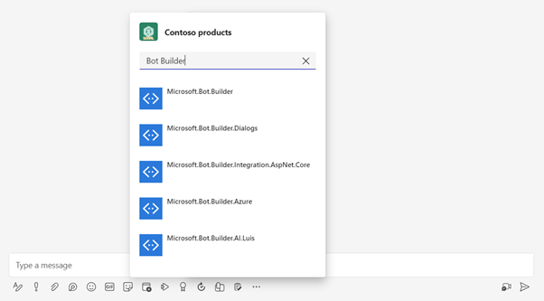

---
lab:
  title: Exercício 1 – Criar uma extensão de mensagem
  module: 'LAB 03: Connect Copilot for Microsoft 365 to your external data in real-time with message extension plugins built with .NET and Visual Studio'
---

# Exercício 1 – Criar uma extensão de mensagem

Neste exercício, você criará uma extensão de mensagem com um comando de pesquisa. Primeiro, faça scaffold de um projeto usando um modelo de projeto do Kit de Ferramentas do Teams e, em seguida, atualiza-o para configurá-lo usando um recurso do Serviço de Bot de IA do Azure para desenvolvimento local. Crie um Túnel do desenvolvedor para habilitar a comunicação entre o serviço de bot e o serviço Web em execução local. Em seguida, prepare o aplicativo para provisionar os recursos necessários. Por fim, você vai executar e depurar sua extensão de mensagem e testá-la no Microsoft Teams.



## Tarefa 1 – Criar um novo projeto com o Kit de Ferramentas do Teams para o Visual Studio

Comece criando um novo projeto.

1. Abra o **Visual Studio 2022**
1. Abra o menu **Arquivo**, expanda o menu **Novo** e selecione **Novo projeto**
1. Na tela Criar um novo projeto, expanda a lista suspensa **Todas as plataformas** e selecione **Microsoft Teams**. Selecione **Avançar** para continuar.
1. Na tela Configurar o novo projeto. Especifique os seguintes valores:
    1. **Nome do projeto**: MsgExtProductSupport
    1. **Local**: escolha o local padrão
1. Faça scaffold do projeto clicando em **Criar**
1. Na caixa de diálogo Criar um novo aplicativo do Teams, expanda a lista suspensa **Todos os tipos de aplicativo** e selecione **Extensão de Mensagem**
1. Na lista de modelos, selecione **Resultados da Pesquisa Personalizados**
1. Faça scaffold do aplicativo clicando em **Criar**

## Tarefa 2 – Configurar o Serviço de Bot de IA do Azure

Um recurso de serviço de bot pode ser criado no Azure como um recurso ou em dev.botframework.com. Por padrão, o modelo Resultados da Pesquisa Personalizados registra um bot usando dev.botframework.com. No momento, registrar o bot com dev.botframework.com não é compatível com o Copilot para Microsoft 365.

Para dar suporte ao Copilot para Microsoft 365, atualize o projeto para provisionar um recurso do Serviço de Bot de IA do Azure no Azure e usá-lo para desenvolvimento local.

Primeiro, vamos criar uma variável de ambiente para centralizar um nome interno para o aplicativo que podemos reutilizar em nossos arquivos e usar ao provisionar recursos.

No Visual Studio:

1. Na pasta **env**, abra **.env.local**
1. No arquivo , adicione o seguinte código:

    ```text
    APP_INTERNAL_NAME=msgext-product-support
    ```

1. Salvar suas alterações

Use expressões de vinculação de dados, como `${{APP_INTERNAL_NAME}}`, que permite injetar valores de variáveis de ambiente em arquivos ao usar o Kit de Ferramentas do Teams para provisionar recursos.

Para provisionar um recurso do Serviço de Bot de IA do Azure, é necessário um registro de aplicativo do Microsoft Entra. Crie um arquivo de manifesto de registro de aplicativo que o Kit de Ferramentas do Teams usa para provisionar o registro de aplicativo.

Continuando no Visual Studio:

1. Na pasta **myApp**, crie uma nova pasta nomeada **entra**.
1. Na pasta, crie um arquivo com o nome **entra.bot.manifest.json**
1. No arquivo , adicione o seguinte código:

    ```json
    {
      "id": "${{BOT_ENTRA_APP_OBJECT_ID}}",
      "appId": "${{BOT_ID}}",
      "name": "${{APP_INTERNAL_NAME}}-bot-${{TEAMSFX_ENV}}",
      "accessTokenAcceptedVersion": 2,
      "signInAudience": "AzureADMultipleOrgs",
      "optionalClaims": {
        "idToken": [],
        "accessToken": [
          {
            "name": "idtyp",
            "source": null,
            "essential": false,
            "additionalProperties": []
          }
        ],
        "saml2Token": []
      },
      "requiredResourceAccess": [],
      "oauth2Permissions": [],
      "preAuthorizedApplications": [],
      "identifierUris": [],
      "replyUrlsWithType": []
    }
    ```

1. Salve suas alterações.

O Kit de Ferramentas do Teams usa arquivos Bicep para provisionar e configurar recursos no Azure. Primeiro, crie um arquivo de parâmetros. O arquivo de parâmetros é usado para passar variáveis de ambiente para um modelo Bicep.

Continuando no Visual Studio:

1. Na pasta **infra**, crie um novo arquivo chamado **azure.parameters.local.json**
1. No arquivo , adicione o seguinte código:

    ```json
    {
      "$schema": "https://schema.management.azure.com/schemas/2015-01-01/deploymentParameters.json#",
      "contentVersion": "1.0.0.0",
      "parameters": {
        "resourceBaseName": {
          "value": "bot-${{RESOURCE_SUFFIX}}-${{TEAMSFX_ENV}}"
        },
        "botEntraAppClientId": {
          "value": "${{BOT_ID}}"
        },
        "botDisplayName": {
          "value": "${{APP_DISPLAY_NAME}}"
        },
        "botAppDomain": {
          "value": "${{BOT_DOMAIN}}"
        }
      }
    }
    ```

1. Salve suas alterações.

Agora, crie um arquivo Bicep que é usado com o arquivo de parâmetros.

1. Na pasta **infra**, crie um arquivo chamado **azure.local.bicep**
1. No arquivo , adicione o seguinte código:

    ```bicep
    @maxLength(20)
    @minLength(4)
    @description('Used to generate names for all resources in this file')
    param resourceBaseName string
    
    @description('Required when create Azure Bot service')
    param botEntraAppClientId string
    @maxLength(42)
    param botDisplayName string
    param botAppDomain string
    
    module azureBotRegistration './botRegistration/azurebot.bicep' = {
      name: 'Azure-Bot-registration'
      params: {
        resourceBaseName: resourceBaseName
        botAadAppClientId: botEntraAppClientId
        botAppDomain: botAppDomain
        botDisplayName: botDisplayName
      }
    }
    ```

1. Salve suas alterações.

A última etapa é atualizar o arquivo de projeto do Kit de Ferramentas do Teams. Substitua as etapas que usam ações do Bot Framework para provisionar o registro do aplicativo de bot do Microsoft Entra usando o arquivo de manifesto e o recurso do Serviço de Bot de IA do Azure usando o arquivo Bicep.

Continuando no Visual Studio:

1. Na pasta raiz do projeto, abra **teamsapp.local.yml**
1. No arquivo, localize a etapa que usa a ação **botAadApp/create** (linha 17-26) e substitua-a por:

    ```yml
      - uses: aadApp/create
        with:
          name: ${{APP_INTERNAL_NAME}}-bot-${{TEAMSFX_ENV}}
          generateClientSecret: true
          signInAudience: AzureADMultipleOrgs
        writeToEnvironmentFile:
          clientId: BOT_ID
          clientSecret: SECRET_BOT_PASSWORD
          objectId: BOT_ENTRA_APP_OBJECT_ID
          tenantId: BOT_ENTRA_APP_TENANT_ID
          authority: BOT_ENTRA_APP_OAUTH_AUTHORITY
          authorityHost: BOT_ENTRA_APP_OAUTH_AUTHORITY_HOST
    
      - uses: aadApp/update
        with:
          manifestPath: "./infra/entra/entra.bot.manifest.json"
          outputFilePath : "./build/entra.bot.manifest.${{TEAMSFX_ENV}}.json"
    
      - uses: arm/deploy
        with:
          subscriptionId: ${{AZURE_SUBSCRIPTION_ID}}
          resourceGroupName: ${{AZURE_RESOURCE_GROUP_NAME}}
          templates:
            - path: ./infra/azure.local.bicep
              parameters: ./infra/azure.parameters.local.json
              deploymentName: Create-resources-for-${{APP_INTERNAL_NAME}}-${{TEAMSFX_ENV}}
          bicepCliVersion: v0.9.1
    ```

1. No arquivo, remova a etapa que usa a ação **botFramework/create** (linhas 53-62).
1. Salve suas alterações.

O registro do aplicativo é provisionado em duas etapas, primeiro a ação **aadApp/create** cria um novo registro de aplicativo multilocatário com um segredo do cliente, gravando suas saídas no arquivo **.env.local** como variáveis de ambiente. Em seguida, a ação **aadApp/update** usa o arquivo **entra.bot.manifest.json** para atualizar o registro do aplicativo.

A última etapa usa a ação **arm/deploy** para provisionar o recurso do Serviço de Bot de IA do Azure para o grupo de recursos usando o arquivo **azure.parameters.local.json** e **azure.local.bicep**.

## Tarefa 3 – Criar um Túnel do desenvolvedor

Quando o usuário interage com a sua extensão de mensagem, o serviço de bot envia solicitações para o serviço Web. Durante o desenvolvimento, o serviço Web é executado localmente no seu computador. Para permitir que o serviço de bot alcance seu serviço Web, você precisa expô-lo além do seu computador usando um Túnel do desenvolvedor.


Continuando no Visual Studio:

1. Na barra de ferramentas, verifique se **MsgExtProductSupport** está selecionado como o projeto de inicialização e expanda o menu do perfil de depuração clicando na lista suspensa ao lado do **botão Microsoft Teams (navegador)** ou **Iniciar Projeto**.
1. Expanda o menu **Túnel do desenvolvedor (nenhum túnel ativo)** e selecione **Criar um túnel...**
1. Na caixa de diálogo, especifique os seguintes valores:
    1. **Conta**: faça logon com sua conta de usuário do Microsoft 365.
    1. **Nome**: MsgExtProductSupport
    1. **Tipo de túnel**: temporário
    1. **Acesso:** público
1. Crie o túnel clicando em **OK**
1. Feche o prompt clicando em **Ok**

## Tarefa 4 – Atualizar o manifesto do aplicativo

O manifesto do aplicativo descreve os recursos e funcionalidades do aplicativo. Atualize as propriedades no manifesto do aplicativo para descrever melhor a funcionalidade do aplicativo e seus recursos.

Primeiro, baixe os ícones do aplicativo e adicione-os ao projeto.


1. Baixe **color-local.png** e **color-dev.png**
1. Na pasta **appPackage**, adicione **color-local.png** e **color-dev.png**
1. Na pasta, exclua o arquivo chamado **color.png**

Como o nome do aplicativo é replicado em locais diferentes no projeto, crie uma nova variável de ambiente para armazenar esse valor de forma centralizada.

Continuando no Visual Studio:

1. Na pasta **env**, abra o arquivo chamado **.env.local**
1. No arquivo , adicione o seguinte código:

    ```text
    APP_DISPLAY_NAME=Contoso products
    ```

1. Salvar suas alterações

Por fim, atualize os ícones, o nome e os objetos de descrição no arquivo de manifesto do aplicativo.

1. Na pasta **appPackage**, abra o arquivo chamado **manifest.json**
1. No arquivo, substitua os **ícones**, o **nome** e os objetos de **descrição** pelo seguinte (linhas 13-24):

    ```json
        "icons": {
            "color": "color-${{TEAMSFX_ENV}}.png",
            "outline": "outline.png"
        },
        "name": {
            "short": "${{APP_DISPLAY_NAME}}",
            "full": "${{APP_DISPLAY_NAME}}"
        },
        "description": {
            "short": "Product look up tool.",
            "full": "Get real-time product information and share them in a conversation."
        },
    ```

1. Salvar suas alterações

## Tarefa 6 – Provisionar recursos

Com tudo pronto, use o kit de ferramentas do Teams para executar o processo Preparar Dependências do Aplicativo do Teams para provisionar os recursos necessários.


O processo Preparar dependências de aplicativo do Teams atualiza as variáveis de ambiente **BOT_ENDPOINT** e **BOT_DOMAIN** no arquivo .env.local usando a URL do túnel de desenvolvimento ativo e executa as ações descritas no arquivo **teamsapp.local.yml**.

Continuando no Visual Studio:

1. No Gerenciador de Soluções, clique com o botão direito do mouse no **TeamsApp** no Gerenciador de Soluções.
1. Expanda o menu Kit de Ferramentas** do Teams**, selecione **Preparar dependências do aplicativo Teams**
1. Na caixa de diálogo **Conta do Microsoft 365**, selecione a conta do locatário de desenvolvedor e selecione **Continuar**
1. Na caixa de diálogo **Provisionar**, selecione a conta a ser usada para implantar recursos no Azure e especifique os seguintes valores:
    1. **Nome da assinatura**: use a lista suspensa para selecionar a assinatura
    1. **Grupo de recursos**: expanda a lista suspensa e selecione o Grupo de recursos que foi pré-criado para sua conta de usuário.
    1. **Região**: use a lista suspensa para escolher a região mais próxima de você
1. Provisionar os recursos no Azure selecionando **Provisionar**
1. No prompt de aviso do Kit de Ferramentas do Teams, clique em **Provisionar**
1. No prompt de informações do Kit de Ferramentas do Teams, selecione **Exibir recursos provisionados** para abrir uma nova janela do navegador.

Reserve um momento para explorar os recursos criados no Azure.

## Tarefa 7 – Executar e depurar  

Agora inicie o serviço Web e teste a extensão de mensagem. Use o Kit de Ferramentas do Teams para carregar o manifesto do aplicativo e testar sua extensão de mensagem no Microsoft Teams.

Continuando no Visual Studio:

1. Pressione F5 para iniciar uma sessão de depuração e abrir uma nova janela do navegador que navega pelo cliente Web do Microsoft Teams.
1. Clique em **Sim** quando solicitado a confiar nos diferentes certificados SSL e, em seguida, clique em **Sim** novamente para quaisquer avisos de segurança. Talvez seja necessário reiniciar o depurador depois de aceitar os certificados.
1. Quando solicitado, insira as credenciais da sua conta do Microsoft 365.

  > [!IMPORTANT]
  > Se aparecer uma caixa de diálogo no Microsoft Teams com a mensagem "Este aplicativo não pode ser encontrado", siga as etapas abaixo para carregar o pacote do aplicativo manualmente:
  >
  >  1. Feche a caixa de diálogo
  >  2. Vá para **Aplicativos** na barra lateral
  >  3. No menu à esquerda, selecione **Gerenciar seus aplicativos**
  >  4. Na barra de comandos, selecione **Carregar um aplicativo**
  >  5. Na caixa de diálogo, selecione **Carregar um aplicativo personalizado**
  >  6. No explorador de arquivos, navegue até a pasta de solução, abra a pasta **appPackage\build**, selecione **appPackage.local.zip** e, em seguida, **Adicionar**

Continue para instalar o aplicativo:

1. Na caixa de diálogo de instalação do aplicativo, selecione **Adicionar**
1. Abra um bate-papo novo ou já existente do Microsoft Teams
1. Na área de composição da mensagem, comece a digitar **/apps** para abrir o submenu.
1. Na lista de aplicativos, selecione **produtos da Contoso** para abrir a extensão de mensagem
1. Na caixa de texto, digite **Bot Builder** para iniciar uma pesquisa
1. Na lista de resultados, selecione um resultado para inserir um cartão na caixa de redigir mensagem

Feche o navegador para interromper a sessão de depuração.

[Continue no próximo exercício...](./3-exercise-add-single-sign-on.md)