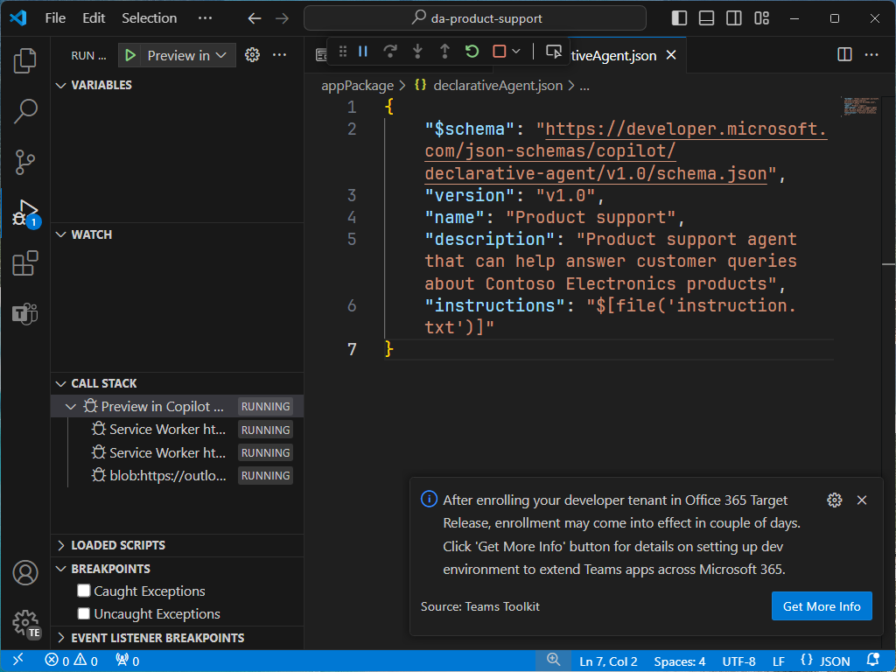
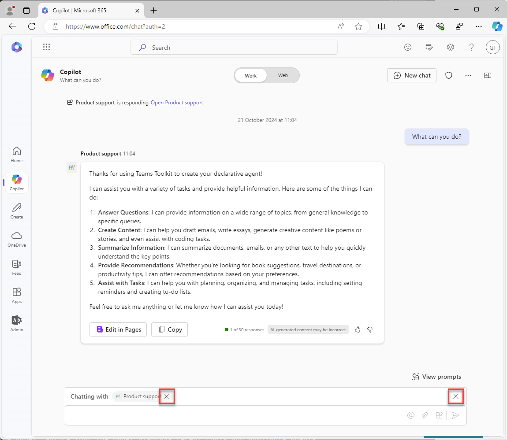

---
lab:
  title: Exercício 1 — Criar um agente declarativo no Visual Studio Code
  module: 'LAB 01: Build a declarative agent for Microsoft 365 Copilot using Visual Studio Code'
---

# Exercício 1 – Criar um agente declarativo

Neste exercício, você criará um projeto de agente declarativo a partir de um modelo, atualizará o manifesto, fará o upload do agente no Microsoft 365 e o testará no Microsoft 365 Copilot. 

Um agente declarativo será implementado em um aplicativo do Microsoft 365. Você criará um pacote de aplicativo contendo:

- app.manifest.json: o arquivo de manifesto do aplicativo descreve como seu aplicativo está configurado, incluindo os recursos.
- declarative-agent.json: o manifesto do agente declarativo descreve como o agente declarativo está configurado.
- color.png e outline.png: um ícone de cor e contorno usado para representar o agente declarativo na interface do usuário do Microsoft 365 Copilot.

### Duração do exercício

- **Tempo estimado para conclusão:** 15 minutos

## Tarefa 1 — Baixar o projeto inicial

Comece baixando o projeto de exemplo no GitHub em um navegador da Web:

1. Navegue até o repositório de modelo [https://github.com/microsoft/learn-declarative-agent-vscode](https://github.com/microsoft/learn-declarative-agent-vscode).
    1. Siga as etapas para [baixar o código-fonte do repositório](https://docs.github.com/repositories/working-with-files/using-files/downloading-source-code-archives#downloading-source-code-archives-from-the-repository-view) no seu computador.
    1. Extraia o conteúdo do arquivo ZIP baixado na **pasta Documentos**.

O projeto inicial contém um projeto do Kit de Ferramentas do Teams que inclui um agente declarativo.

1. Abra a pasta do projeto  no Visual Studio Code.
1. Na pasta raiz do projeto, abra o arquivo **README.md**. Examine o conteúdo para obter mais informações sobre a estrutura do projeto.


## Tarefa 2 — Examinar o manifesto do agente declarativo

Vamos examinar o arquivo de manifesto do agente declarativo:

- Abra o arquivo **appPackage/declarativeAgent.json** e examine o conteúdo:

    ```json
    {
        "$schema": "https://aka.ms/json-schemas/agent/declarative-agent/v1.0/schema.json",
        "version": "v1.0",
        "name": "da-product-support",
        "description": "Declarative agent created with Teams Toolkit",
        "instructions": "$[file('instruction.txt')]"
    }
    ```

O valor da propriedade **instructions** contém uma referência a um arquivo chamado **instruction.txt**. A função **$[file(path)]** é fornecida pelo Kit de Ferramentas do Teams. O conteúdo de **instruction.txt** é incluído no arquivo de manifesto do agente declarativo quando provisionado para o Microsoft 365.

- Na pasta **appPackage**, abra o arquivo **instruction.txt** e revise o conteúdo:

    ```md
    You are a declarative agent and were created with Team Toolkit. You should start every response and answer to the user with "Thanks for using Teams Toolkit to create your declarative agent!\n\n" and then answer the questions and help the user.
    ```

## Tarefa 3 — Atualizar o manifesto do agente declarativo

Vamos atualizar as propriedades **name** e **description** para serem mais relevantes para nosso cenário.

1. Na pasta **appPackage**, abra o arquivo **declarativeAgent.json**.
1. Atualize o valor da propriedade **name** para **Suporte ao produto**.
1. Atualize o valor da propriedade **description** para **Agente de suporte ao produto que pode ajudar a responder às consultas dos clientes sobre os produtos da Contoso Electronics**.
1. Salvar suas alterações

O arquivo atualizado deve ter o seguinte conteúdo:

```json
{
    "$schema": "https://aka.ms/json-schemas/agent/declarative-agent/v1.0/schema.json",
    "version": "v1.0",
    "name": "Product support",
    "description": "Product support agent that can help answer customer queries about Contoso Electronics products",
    "instructions": "$[file('instruction.txt')]"
}
```

## Tarefa 4 — Carregar o agente declarativo no Microsoft 365

> [!IMPORTANT]
> Antes de começar, verifique se a extensão do Kit de Ferramentas do Teams está instalada no Visual Studio Code. Se você ainda não instalou a extensão do marketplace, faça isso agora.

Em seguida, carregue o agente declarativo no locatário do Microsoft 365.

No Visual Studio Code:

1. Na **Barra de Atividades**, abra a extensão **Kit de Ferramentas do Teams**.

    

1. Na seção **Ciclo de vida**, selecione **Provisionar**.

    

1. No prompt, selecione **Entrar** e siga os prompts para entrar no locatário do Microsoft 365 usando o Kit de Ferramentas do Teams. O processo de provisionamento é iniciado automaticamente depois que você entra.

    

    

1. Aguarde o upload ser concluído antes de continuar.

    

Em seguida, revise a saída do processo de provisionamento.

- Na pasta **appPackage/build**, abra o arquivo **declarativeAgent.dev.json**.

Observe que o valor da propriedade **instructions** contém o conteúdo do arquivo **instruction.txt**. O arquivo **declarativeAgent.dev.json** está incluso no arquivo **appPackage.dev.zip** junto com os arquivos **manifest.dev.json**, **color.png** e **outline.png**. O arquivo **appPackage.dev.zip** é carregado no Microsoft 365.

## Tarefa 5 — Testar o agente declarativo no Microsoft 365 Copilot

Em seguida, vamos executar o agente declarativo no Microsoft 365 Copilot e validar sua funcionalidade nas experiências **no contexto** e **imersiva**.

No Visual Studio Code:

1. Na **Barra de Atividades**, alterne para a exibição **Executar e Depurar**.

    

1. Clique no botão **Iniciar Depuração** ao lado da lista suspensa da configuração ou pressione <kbd>F5</kbd>. Uma nova janela do navegador é iniciada e abre o Microsoft 365 Copilot.

    

    

    

Continuando no navegador, vamos testar a experiência **no contexto**.

1. No **Microsoft 365 Copilot**, na caixa de mensagem, insira o símbolo <kbd>@</kbd>. O submenu aparecerá com uma lista de agentes disponíveis.

    

1. No submenu, selecione **Suporte ao produto**. Observe a mensagem de status acima da caixa de mensagem: **Chat com o suporte ao produto**, o que significa que você está usando a experiência no contexto do agente.

    

1. Na caixa de texto, digite **O que você pode fazer?** e envie sua mensagem.

    

1. Aguarde a resposta. Observe como a resposta começa com o texto "Agradecemos por usar o Kit de Ferramentas do Teams para criar seu agente declarativo!" conforme definido nas instruções que você revisou anteriormente.

    

1. Para sair da experiência no contexto, clique na cruz (X) na mensagem de status. Observe que a mensagem de status foi removida e uma mensagem é exibida na janela do chat indicando que você não está mais conversando com o agente.

    

    

Por fim, vamos testar a experiência **imersiva**.

Ainda no navegador:

1. No **Microsoft 365 Copilot**, clique no ícone no canto superior direito para expandir o painel lateral do Copilot. Observe que o painel exibe chats recentes e agentes disponíveis.

    

1. No painel lateral, selecione **Suporte ao produto** para entrar na experiência imersiva e conversar diretamente com o agente. Observe dois prompts de exemplo exibidos na interface.

    

1. Selecione o prompt de exemplo com o título **Saiba mais**. Observe que o texto **O que você pode fazer?** é adicionado à caixa de mensagem para você.

    

1. Envie a mensagem e aguarde a resposta. Observe como a resposta começa com o texto "Agradecemos por usar o Kit de Ferramentas do Teams para criar seu agente declarativo!" conforme definido nas instruções que você revisou anteriormente.

    

Por fim, feche o navegador para interromper a sessão de depuração no Visual Studio Code.