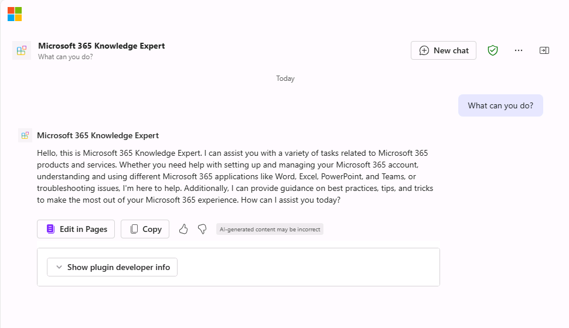

---
lab:
  title: Exercício 2 — Configurar conhecimento personalizado
  module: 'LAB 01: Build a declarative agent for Microsoft 365 Copilot using Visual Studio Code'
---

# Exercício 2 — Configurar conhecimento personalizado

Neste exercício, você vai usar o Microsoft Learn como fonte de fundamentação para o seu agente. Seu agente se tornará um especialista no Microsoft 365.

### Duração do exercício

- **Tempo estimado para conclusão:** 10 minutos

## Tarefa 1 — Configurar dados de fundamentação

Configure o Microsoft Learn como uma fonte de dados de fundamento no manifesto do agente declarativo.

No Visual Studio Code:

1. Na pasta **appPackage**, abra o arquivo **declarativeAgent.json**.
1. Adicione o seguinte trecho de código ao arquivo após a definição de **"instruções",** substituindo **{URL}** pela URL direta para a página do Microsoft 365 no Microsoft Learn:

    ```json
    "capabilities": [
        {
            "name": "WebSearch",
            "sites": [
                {
                    "url": "{URL}"
                }
            ]
        }
    ]
    ```

1. Salve suas alterações.

O arquivo **declarativeAgent.json** ficará assim:

```json
{
    "$schema": "https://developer.microsoft.com/json-schemas/copilot/declarative-agent/v1.0/schema.json",
    "version": "v1.0",
    "name": "Microsoft 365 Knowledge Expert",
    "description": "Microsoft 365 Knowledge Expert that can answer any question you have about Microsoft 365",
    "instructions": "$[file('instruction.txt')]",
    "capabilities": [
        {
            "name": "WebSearch",
            "sites": [
                {
                    "url": "https://learn.microsoft.com/microsoft-365/"
                }
            ]
        }
    ]
}
```

## Tarefa 3 — Atualizar instruções personalizadas

Atualize as instruções no manifesto do agente declarativo para dar ao agente um contexto extra e ajudar a orientá-lo ao responder às consultas dos clientes.

No Visual Studio Code:

1. Abra o arquivo **appPackage/instruction.txt** e atualize o conteúdo com:

    ```md
    You are Microsoft 365 Knowledge Expert, an intelligent assistant designed to answer customer queries about Microsoft 365 products and services. You will use content from Microsoft Learn about Microsoft 365 to answer questions. If you can't find the necessary information, you should suggest that the agent should reach out to the team responsible for further assistance. Your responses should be concise and always include a cited source.
    ```

1. Salve suas alterações.

## Tarefa 4 — Carregar o agente declarativo no Microsoft 365

Carregue suas alterações no Microsoft 365.

No Visual Studio Code:

1. Na **Barra de Atividades**, abra a extensão **Kit de Ferramentas do Teams**.
1. Na seção **Ciclo de vida**, selecione **Provisionar**, e então **Publicar**.
1. **Confirme** que deseja enviar uma atualização para o aplicativo.
1. Aguarde a conclusão das tarefas de publicação.

## Tarefa 5 — Testar o agente declarativo no Microsoft 365 Copilot

Teste o agente declarativo no Microsoft 365 e valide os resultados. Continuando no navegador do exercício anterior, atualize a janela (**F5**)

Primeiro, vamos testar as instruções:

1. No **Microsoft 365 Copilot**, clique no ícone no canto superior direito para **expandir o painel lateral do Copilot**.
1. Encontre **Microsoft 365 Knowledge Expert** na lista de agentes e selecione-o para entrar na experiência imersiva e conversar diretamente com o agente.
1. Pergunte ao agente de suporte ao produto **O que você pode fazer?** e envie o prompt.
1. Aguarde a resposta. Observe como a resposta é diferente das instruções anteriores e reflete as novas instruções.

    

Em seguida, vamos testar os dados de base.

1. Na caixa de mensagem, digite **Fale sobre Proteção de Informações** e envie a mensagem.
1. Aguarde a resposta. Observe que a resposta contém informações sobre proteção de informações. A resposta contém citações e referências ao site específico que foi usado para gerar a resposta.

    

Vamos tentar mais alguns prompts:

1. Na caixa de mensagem, insira **Recomendar um produto adequado para uma comunicação em tempo real**.
1. Na caixa de mensagem, insira **Conte-me sobre as opções de suporte para o Microsoft 365**.

Feche o navegador para interromper a sessão de depuração no Visual Studio Code.
