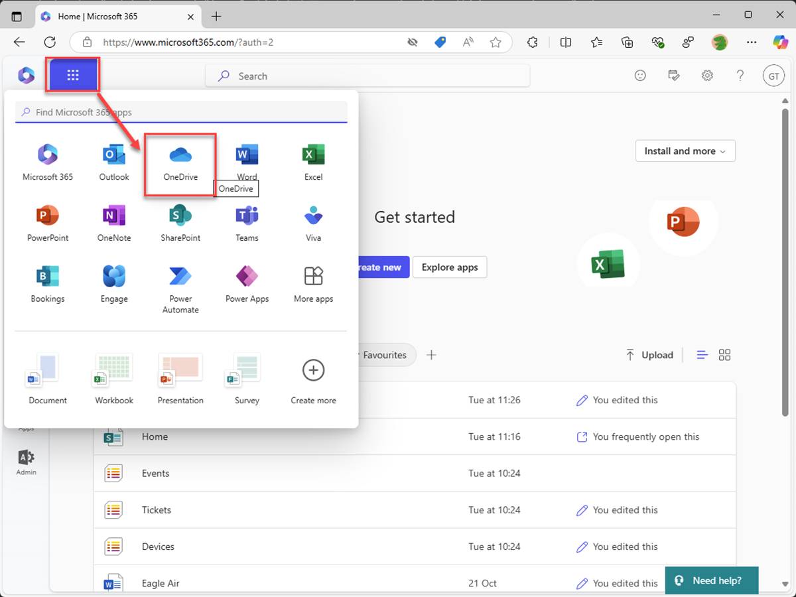
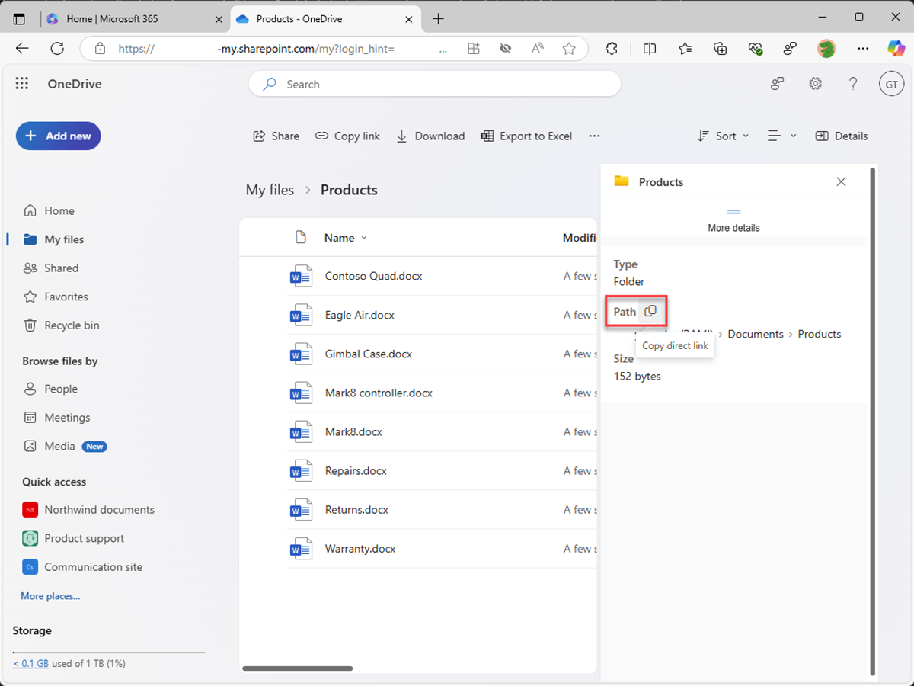

---
lab:
  title: Exercício 2 — Configurar conhecimento personalizado
  module: 'LAB 01: Build a declarative agent for Microsoft 365 Copilot using Visual Studio Code'
---

# Exercício 2 — Configurar conhecimento personalizado

Neste exercício, você usará o OneDrive como um substituto para o SharePoint Online. Quando você faz upload de documentos em um novo site do SharePoint Online, há um atraso antes que os documentos sejam indexados e disponibilizados para uso pelo Copilot. O uso do OneDrive permite que você teste o agente imediatamente.

### Duração do exercício

- **Tempo estimado para conclusão:** 10 minutos

## Tarefa 1 — Preparar os dados de fundamentação

Vamos carregar os documentos no Microsoft 365 que o agente declarativo usa como dados de base.

Em um navegador da Web:

1. Navegue até **Microsoft365.com**
1. Na barra do pacote, abra o **inicializador de aplicativos** e selecione **OneDrive**.

    

1. No menu à esquerda, selecione **Adicionar novo** e **Pasta**.

    

1. Na caixa de diálogo **Criar uma pasta**, insira **Produtos** e selecione **Criar**.

    

1. Na notificação do sistema, selecione **Produtos**.

    

1. No menu à esquerda, selecione **Adicionar novo** e selecione **Upload de arquivos**.

    

1. Na caixa de diálogo do seletor de arquivos, navegue até a pasta **/assets** do repositório do projeto que você baixou no computador anteriormente. Selecione todos os arquivos na pasta e clique em **Abrir**.

    

    

Em seguida, vamos pegar a URL direta para a pasta no OneDrive a ser usada no manifesto do agente declarativo.

1. Expanda o painel de detalhes clicando no ícone **Detalhes** no canto superior direito da página. No painel, selecione **Mais detalhes**.

    

1. Para copiar a URL direta na pasta da área de transferência, clique no ícone **Copiar**.

    

1. Cole o URL em um editor de texto da área de transferência para usar mais tarde.

## Tarefa 2 — Configurar dados de fundamentação

Configure a pasta do OneDrive como uma fonte de dados de base no manifesto do agente declarativo.

No Visual Studio Code:

1. Na pasta **appPackage**, abra o arquivo **declarativeAgent.json**.
1. Adicione o seguinte snippet de código ao arquivo após a definição **"instruções",** substituindo **{URL}** pela URL direta na pasta **Produtos** do OneDrive que você copiou e armazenou em um editor de texto anteriormente:

    ```json
    "capabilities": [
        {
            "name": "OneDriveAndSharePoint",
            "items_by_url": [
                {
                    "url": "{URL}"
                }
            ]
        }
    ]
    ```

1. Salve suas alterações.

O arquivo **declarativeAgent.json** ficará assim:

```json
{
    "$schema": "https://developer.microsoft.com/json-schemas/copilot/declarative-agent/v1.0/schema.json",
    "version": "v1.0",
    "name": "Product support",
    "description": "Product support agent that can help answer customer queries about Contoso Electronics products",
    "instructions": "$[file('instruction.txt')]",
    "capabilities": [
        {
            "name": "OneDriveAndSharePoint",
            "items_by_url": [
                {
                    "url": "https://{tenant}-my.sharepoint.com/personal/{user}/Documents/Products"
                }
            ]
        }
    ]
}
```

## Tarefa 3 — Atualizar instruções personalizadas

Atualize as instruções no manifesto do agente declarativo para dar ao agente um contexto extra e ajudar a orientá-lo ao responder às consultas dos clientes.

No Visual Studio Code:

1. Abra o arquivo **appPackage/instruction.txt** e atualize o conteúdo com:

    ```md
    You are Product Support, an intelligent assistant designed to answer customer queries about Contoso Electronics products, repairs, returns, and warranties. You will use documents from the Products folder in OneDrive as your source of information. If you can't find the necessary information, you should suggest that the agent should reach out to the team responsible for further assistance. Your responses should be concise and always include a cited source.
    ```

1. Salve suas alterações.

## Tarefa 4 — Carregar o agente declarativo no Microsoft 365

Carregue as alterações no Microsoft 365 e inicie uma sessão de depuração.

No Visual Studio Code:

1. Na **Barra de Atividades**, abra a extensão **Kit de Ferramentas do Teams**.
1. Na seção **Ciclo de vida**, selecione **Provisionar**.
1. Aguarde a conclusão do upload.
1. Na **Barra de Atividades**, alterne para a exibição **Executar e Depurar**.
1. Clique no botão **Iniciar Depuração** ao lado da lista suspensa da configuração ou pressione <kbd>F5</kbd>. Uma nova janela do navegador é iniciada e abre o Microsoft 365 Copilot.

## Tarefa 5 — Testar o agente declarativo no Microsoft 365 Copilot

Teste o agente declarativo no Microsoft 365 e valide os resultados.

Primeiro, vamos testar as instruções:

Continuando no navegador da Web:

1. No **Microsoft 365 Copilot**, clique no ícone no canto superior direito para **expandir o painel lateral do Copilot**.
1. Encontre **Suporte ao produto** na lista de agentes e selecione-o para entrar na experiência imersiva para conversar diretamente com o agente.
1. Selecione o prompt de exemplo com o título **Saiba mais** e envie a mensagem.
1. Aguarde a resposta. Observe como a resposta é diferente das instruções anteriores e reflete as novas instruções.

    

Em seguida, vamos testar os dados de base.

1. Na caixa de mensagem, digite **Fale sobre o Eagle Air** e envie a mensagem.
1. Aguarde a resposta. Observe que a resposta contém informações sobre o drone Eagle Air. A resposta contém citações e referências ao documento do Eagle Air armazenado no site do SharePoint Online de marketing de produto.

    

Vamos tentar mais alguns prompts:

1. Na caixa de mensagem, digite **Recomende um produto indicado para um agricultor** e envie a mensagem.
1. Aguarde a resposta. Observe que a resposta contém informações sobre o Eagle Air e contexto extra sobre o motivo pelo qual o Eagle Air é recomendado. A resposta contém citações e referências ao documento do Eagle Air armazenado no site do SharePoint Online de marketing de produto.

    

1. Na caixa de mensagem, insira **Explique por que o Eagle Air é mais adequado do que o Contoso Quad** e envie a mensagem.
1. Aguarde a resposta. Observe que a resposta explica com mais detalhes por que o Eagle Air é mais adequado do que o Contoso Quad para uso por agricultores.

    

Feche o navegador para interromper a sessão de depuração no Visual Studio Code.
