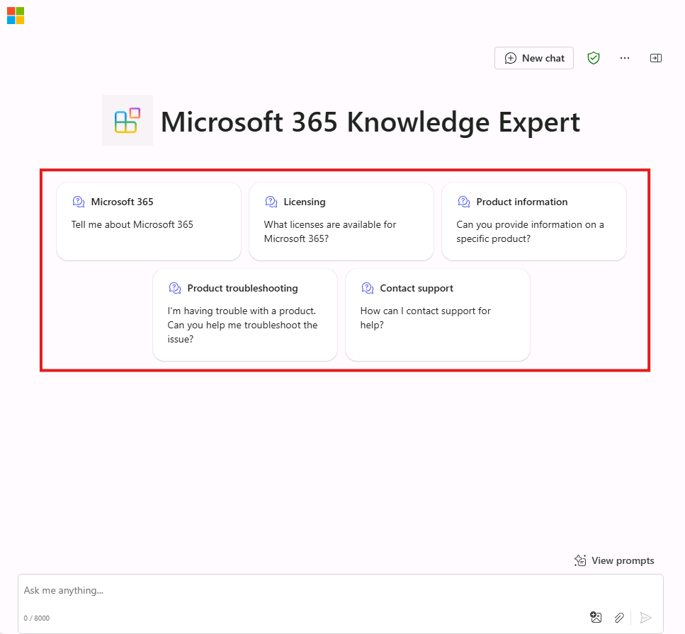

---
lab:
  title: Exercício 3 — Adicionar iniciadores de conversa ao seu agente declarativo
  module: 'LAB 01: Build a declarative agent for Microsoft 365 Copilot using Visual Studio Code'
---

# Exercício 3 — Adicionar iniciadores de conversa ao seu agente declarativo

Neste exercício, você atualizará o agente declarativo para incluir iniciadores de conversas que fornecem aos usuários exemplos de prompts para ajudá-los a entender os tipos de perguntas que eles podem fazer.

### Duração do exercício

- **Tempo estimado para conclusão:** 5 minutos

## Tarefa 1 — Adicionar iniciadores de conversa

No Visual Studio Code:

1. Na pasta **appPackage**, abra o arquivo **declarativeAgent.json**.
1. Adicione o seguinte snippet de código ao arquivo :

   ```json
   "conversation_starters": [
       {
           "title": "Product information",
           "text": "Tell me about Eagle Air"
       },
       {
           "title": "Returns policy",
           "text": "What is the returns policy?"
       },
       {
           "title": "Product information",
           "text": "Can you provide information on a specific product?"
       },
       {
           "title": "Product troubleshooting",
           "text": "I'm having trouble with a product. Can you help me troubleshoot the issue?"
       },
       {
           "title": "Repair information",
           "text": "Can you provide information on how to get a product repaired?"
       },
       {
           "title": "Contact support",
           "text": "How can I contact support for help?"
       }
   ]
   ```

1. Salve suas alterações.

O arquivo **declarativeAgent.json** ficará assim:

```json
{
  "$schema": "https://developer.microsoft.com/json-schemas/copilot/declarative-agent/v1.0/schema.json",
  "version": "v1.0",
  "name": "Product support",
  "description": "Product support agent that can help answer customer queries about Contoso Electronics products",
  "instructions": "$[file('instruction.txt')]",
  "capabilities": [
    {
      "name": "OneDriveAndSharePoint",
      "items_by_url": [
        {
          "url": "https://{tenant}-my.sharepoint.com/personal/{user}/Documents/Products"
        }
      ]
    }
  ],
  "conversation_starters": [
    {
      "title": "Product information",
      "text": "Tell me about Eagle Air"
    },
    {
      "title": "Returns policy",
      "text": "What is the returns policy?"
    },
    {
      "title": "Product information",
      "text": "Can you provide information on a specific product?"
    },
    {
      "title": "Product troubleshooting",
      "text": "I'm having trouble with a product. Can you help me troubleshoot the issue?"
    },
    {
      "title": "Repair information",
      "text": "Can you provide information on how to get a product repaired?"
    },
    {
      "title": "Contact support",
      "text": "How can I contact support for help?"
    }
  ]
}
```

## Tarefa 2 — Testar o agente declarativo no Microsoft 365 Copilot

Em seguida, faça o upload das alterações e inicie uma sessão de depuração.

No Visual Studio Code:

1. Na **Barra de Atividades**, abra a extensão **Kit de Ferramentas do Teams**.
1. Na seção **Ciclo de vida**, selecione **Provisionar**.
1. Aguarde a conclusão do upload.
1. Na **Barra de Atividades**, alterne para a exibição **Executar e Depurar**.
1. Clique no botão **Iniciar Depuração** ao lado da lista suspensa da configuração ou pressione <kbd>F5</kbd>. Uma nova janela do navegador é iniciada e abre o Microsoft 365 Copilot.

Em seguida, teste o agente declarativo no Microsoft 365 e valide os resultados.

Continuando no navegador da Web:

1. No **Microsoft 365 Copilot**, clique no ícone no canto superior direito para expandir o **painel lateral do Copilot**.
1. Encontre **Suporte ao produto** na lista de agentes e selecione-o para entrar na experiência imersiva para conversar diretamente com o agente. Observe que os iniciadores de conversa que você definiu no manifesto são exibidos na interface do usuário.



Feche o navegador para interromper a sessão de depuração no Visual Studio Code.