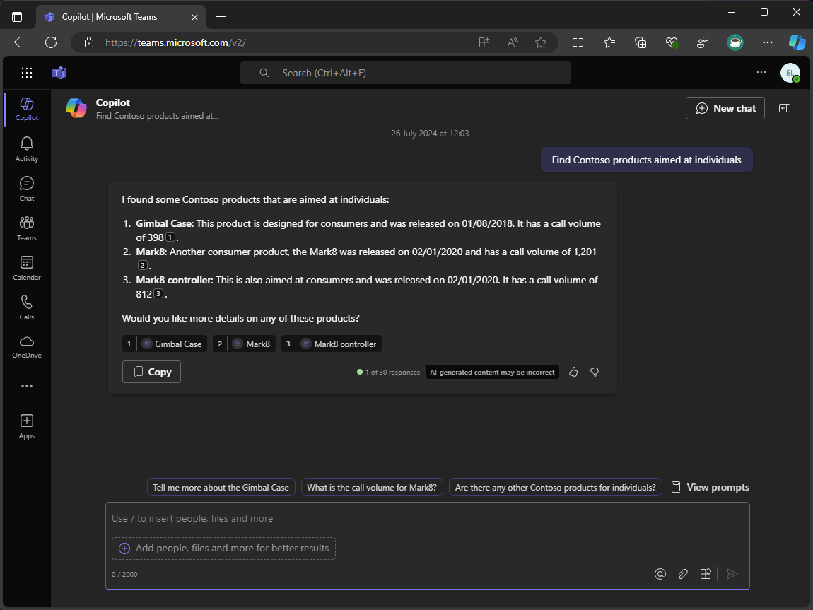

---
lab:
  title: Exercício 4 – Estender e otimizar extensões de mensagem para uso com o Microsoft 365 Copilot
  module: 'LAB 01: Connect Microsoft 365 Copilot to your external data in real-time with message extension plugins built with .NET and Visual Studio'
---

# Exercício 4 – Estender e otimizar extensões de mensagem para uso com o Microsoft 365 Copilot

Neste exercício, você estenderá e otimizará sua extensão de mensagem para uso com o Microsoft 365 Copilot. Você adicionará um novo parâmetro chamado Público-alvo e atualizará a lógica de extensão de mensagem para manipular vários parâmetros. Por último, você executará e depurará a extensão de mensagem e a testará no Copilot no Microsoft Teams.



> [!NOTE]
> A única tarefa neste exercício que requer uma licença do Microsoft 365 Copilot é a Tarefa 5. As tarefas anteriores devem ser feitas independentemente de o locatário ter o Copilot ou não.

### Duração do exercício

  - **Tempo estimado para conclusão:** 40 minutos

## Tarefa 1 – Atualizar a descrição do aplicativo

Especificar descrições concisas e precisas no manifesto do aplicativo é fundamental para garantir que o Copilot saiba quando e como invocar o seu plug-in. Atualize as descrições do aplicativo, do comando e do parâmetro no manifesto do aplicativo.

Abra o Visual Studio e, no projeto **TeamsApp**:

1. Na pasta **appPackage**, abra o arquivo **manifest.json**.

1. Atualize o objeto **descrição**

    ```json
    "description": {
        "short": "Product look up tool.",
        "full": "Get real-time product information and share them in a conversation. Search by product name or target audience. ${{APP_DISPLAY_NAME}} works with Microsoft 365 Chat. Find products at Contoso. Find Contoso products called mark8. Find Contoso products named mark8. Find Contoso products related to Mark8. Find Contoso products aimed at individuals. Find Contoso products aimed at businesses. Find Contoso products aimed at individuals with the name mark8. Find Contoso products aimed at businesses with the name mark8."
    },
    ```

## Tarefa 2 – Adicionar novo parâmetro

Adicione um novo parâmetro que o Copilot pode usar. Esse novo parâmetro ajuda os usuários a pesquisar produtos usando o Copilot voltado para diferentes públicos, como pessoas físicas e jurídicas.

Continuando no Visual Studio e no projeto **TeamsApp**:

1. Em **manifest.json**, na matriz **parâmetros**, adicione o parâmetro **TargetAudience** após o parâmetro **ProductName**:

    ```json
    "parameters": [
        {
            "name": "ProductName",
            "title": "Product name",
            "description": "The name of the product as a keyword",
            "inputType": "text"
        },
        {
            "name": "TargetAudience",
            "title": "Target audience",
            "description": "Audience that the product is aimed at. Consumer products are sold to individuals. Enterprise products are sold to businesses",
            "inputType": "text"
        }
    ]
    ```

1. Salve suas alterações.

A descrição do parâmetro **TargetAudience** descreve o que ele é e explica que o parâmetro deve aceitar **Consumidor** ou **Empresa** como valores permitidos.

Em seguida, atualize a descrição do comando para incluir o novo parâmetro.

1. Na matriz **comandos**, atualize a **descrição** do comando na **linha 36**:

    ```json
    "description": "Find products by name or by target audience.",
    ```

## Tarefa 3 – Atualizar lógica de extensão de mensagem

Para aceitar o novo parâmetro e prompts complexos, atualize o método **OnTeamsMessagingExtensionQueryAsync** no Manipulador de Atividades de Bots para manipular vários parâmetros.

Primeiro, atualize a classe **ProductService** para recuperar produtos com base nos parâmetros nome e público-alvo.

Continuando no Visual Studio no projeto **ProductPlugin**:

1. Na pasta **Serviços**, abra **ProductsService.cs**.

1. No arquivo, crie novos métodos chamados **GetProductsByCategoryAsync** e **GetProductsByNameAndCategoryAsync**:

    ```csharp
    internal async Task<Product[]> GetProductsByCategoryAsync(string category)
    {
        var response = await _httpClient.GetAsync($"{_baseUri}products?category={category}");
        response.EnsureSuccessStatusCode();
        var jsonString = await response.Content.ReadAsStringAsync();
        return System.Text.Json.JsonSerializer.Deserialize<Product[]>(jsonString);
    }
    internal async Task<Product[]> GetProductsByNameAndCategoryAsync(string name, string category)
    {
        var response = await _httpClient.GetAsync($"{_baseUri}?name={name}&category={category}");
        response.EnsureSuccessStatusCode();
        var jsonString = await response.Content.ReadAsStringAsync();
        return System.Text.Json.JsonSerializer.Deserialize<Product[]>(jsonString);
    }
    ```

1. Salve suas alterações.

Em seguida, adicione um novo método à classe **MessageExtensionHelper** para recuperar produtos com base nos parâmetros nome e público-alvo.

1. Na pasta **Auxiliares**, abra **MessageExtensionHelper.cs**.

1. No arquivo, crie um novo método chamado **RetrieveProducts** que recupera produtos com base nos parâmetros nome e público-alvo.

    ```csharp
    internal static async Task<IList<Product>> RetrieveProducts(string name, string audience, ProductsService productsService)
    {
        IList<Product> products;
        if (string.IsNullOrEmpty(name) && !string.IsNullOrEmpty(audience))
        {
            products = await productsService.GetProductsByCategoryAsync(audience);
        }
        else if (!string.IsNullOrEmpty(name) && string.IsNullOrEmpty(audience))
        {
            products = await productsService.GetProductsByNameAsync(name);
        }
        else if (!string.IsNullOrEmpty(name) && !string.IsNullOrEmpty(audience))
        {
            products = await productsService.GetProductsByNameAndCategoryAsync(name, audience);
        }
        else
        {
            products = [];
        }
        return products;
    }
    ```

1. Salve suas alterações.

O método **RetrieveProduct** recupera produtos com base nos parâmetros nome e público-alvo. Se o parâmetro nome estiver vazio e o parâmetro público-alvo não estiver vazio, o método recuperará produtos com base no parâmetro público-alvo. Se o parâmetro nome não estiver vazio e o parâmetro público-alvo estiver vazio, o método recuperará produtos com base no parâmetro nome. Se os parâmetros nome e público-alvo não estiverem vazios, o método recuperará produtos com base em ambos os parâmetros. Se ambos os parâmetros estiverem vazios, o método retornará uma lista vazia.

Em seguida, atualize a classe **SearchApp** para manipular o novo parâmetro.

1. Na pasta **Pesquisar**, abra **SearchApp.cs**.

1. No método **OnTeamsMessagingExtensionQueryAsync**, substitua o seguinte código começando na **linha 30**:

    ```csharp
    var name = MessageExtensionHelpers.GetQueryParameterValueByName(query.Parameters, "ProductName");
    var productService = new ProductsService(tokenResponse.Token);
    var products = await productService.GetProductsByNameAsync(name);
    ```

    Por:

    ```csharp
    var name = MessageExtensionHelpers.GetQueryParameterValueByName(query.Parameters, "ProductName");
    var audience = MessageExtensionHelpers.GetQueryParameterValueByName(query.Parameters, "TargetAudience");
    var productService = new ProductsService(tokenResponse.Token);
    var products = await MessageExtensionHelpers.RetrieveProducts(name, audience, productService);
    ```

1. Salve suas alterações.

O método **OnTeamsMessagingExtensionQueryAsync** agora recupera os parâmetros nome e público-alvo a partir dos parâmetros de consulta. Em seguida, ele recupera produtos com base nos parâmetros nome e público-alvo usando o método **RetrieveProducts**.

## Tarefa 4 – Criar e atualizar recursos

Feito tudo isso, execute o processo **Preparar dependências do aplicativo Teams** para criar novos recursos e atualizar os já existentes.

Continuando no Visual Studio:

1. No **Gerenciador de Soluções**, clique com o botão direito do mouse no projeto **TeamsApp**.

1. Expanda o menu **Kit de Ferramentas do Teams** e selecione **Preparar dependências do aplicativo Teams**.

1. Na caixa de diálogo **Conta do Microsoft 365**, clique em **Continuar**.

1. Na caixa de diálogo **Provisionar**, clique em **Provisionar**.

1. Na caixa de diálogo de **aviso do Kit de Ferramentas do Teams**, clique em **Provisionar**.

1. Na caixa de diálogo de **informações do Kit de Ferramentas do Teams**, clique no ícone de cruz para fechar a caixa de diálogo.

## Tarefa 5 – Executar e depurar

Com os recursos provisionados, inicie uma sessão de depuração para testar a extensão da mensagem.

Primeiro, inicie o **proxy de desenvolvimento** para simular a API personalizada.

1. Na **janela do prompt de comando** que ainda está aberta, execute o seguinte comando para iniciar o proxy de desenvolvimento:

1. Execute o comando a seguir para iniciar o proxy de desenvolvimento:

   ```bash
   devproxy --config-file "~appFolder/presets/learn-copilot-me-plugin/products-api-config.json"
   ```

1. Se solicitado, aceite os avisos de certificado.

> [!NOTE]
> Quando o proxy de desenvolvimento estiver em execução, ele atuará como um proxy de todo o sistema.

Em seguida, inicie uma sessão de depuração no Visual Studio:

1. Para iniciar uma nova sessão de depuração, pressione <kbd>F5</kbd> ou clique em **Iniciar** na barra de ferramentas.

1. Aguarde até que uma janela do navegador seja aberta e a caixa de diálogo de instalação do aplicativo apareça no cliente Web do Microsoft Teams. Se solicitado, insira as credenciais da sua conta do Microsoft 365.

1. Na caixa de diálogo de instalação do aplicativo, selecione **Adicionar**.

1. Abra o aplicativo **Copilot** no Microsoft Teams.

1. Na área de redigir mensagem, abra o submenu **Plug-ins**.

1. Na lista de plug-ins, alterne o plug-in de **produtos da Contoso** para habilitá-lo.

    

1. Insira **Localizar produtos da Contoso destinados a indivíduos** como mensagem e envie-a.

1. Aguarde a resposta do Copilot:

    

1. Na resposta do Copilot, os dados retornados na resposta do plug-in são exibidos e o plug-in é referenciado na resposta:

    

1. Para exibir o Cartão Adaptável relevante para o resultado, passe o mouse sobre as referências na resposta do Copilot:

    

Retorne ao Visual Studio e selecione **Parar** na barra de ferramentas ou pressione <kbd>Shift</kbd> + <kbd>F5</kbd> para interromper a sessão de depuração. Além disso, encerre o proxy de desenvolvimento pressionando <kbd>Ctrl</kbd> + <kbd>C</kbd>.

[Continue no resumo do laboratório...](./6-summary.md)