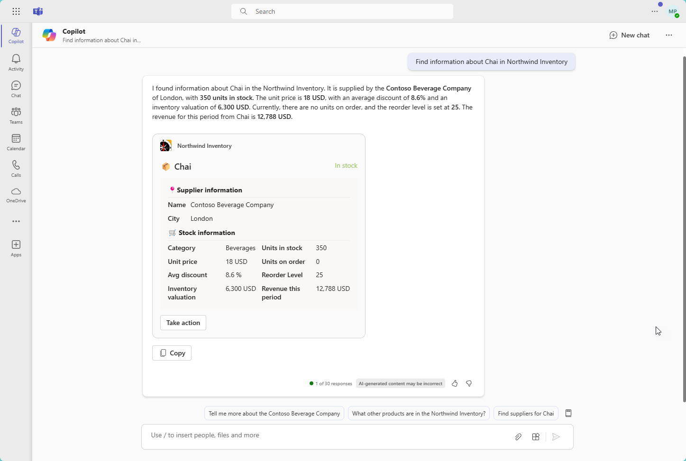

---
lab:
  title: Exercício 2 – Executar o exemplo como um plug-in do Copilot
  module: 'LAB 02: Build your own message extension plugin with TypeScript (TS) for Microsoft Copilot'
---

# Exercício 2 – Executar o exemplo como um plug-in do Copilot

Neste exercício, você executará o aplicativo como um plug-in para o Microsoft Copilot para Microsoft 365. Você testará vários prompts e observará como o plug-in é invocado usando diferentes parâmetros.

> [!NOTE]  
> Para fazer o exercício a seguir, sua conta deve ter uma licença válida para o Copilot para Microsoft 365.

## Tarefa 1– Testar no Microsoft Copilot para Microsoft 365 (parâmetro único)

1. No trilho do aplicativo à esquerda, selecione o aplicativo **Copilot**.

1. No lado direito da caixa de redigir, clique no ícone do **plug-in** 1️⃣ e ative o plug-in do **Inventário da Northwind** 2️⃣.

    

1. Para obter melhores resultados, selecione o ícone **Novo chat** no canto superior direito antes de cada prompt ou conjunto de prompts relacionados.

    

1. Teste os seguintes prompts que usam apenas um único parâmetro da extensão de mensagem:

    - _Encontre informações sobre Chá no Inventário da Northwind._

    - _Encontre frutos do mar com desconto na Northwind. Mostre uma tabela com os produtos, nomes de fornecedores, taxa média de desconto e receita por período._

O último deve fazer referência aos documentos que você carregou no OneDrive. Enquanto você está testando, observe as mensagens de log no Visual Studio Code. Você verá quando o Copilot chama seu plug-in e envia uma consulta. Por exemplo, depois de solicitar **itens de frutos do mar com desconto**, o Copilot emitiu essa consulta usando o comando `discountSearch`.


Pode ser que você veja citações dos dados da Northwind em três formulários. Se houver uma única referência, o Copilot talvez mostre o cartão inteiro.



Se houver várias referências, o Copilot talvez mostre um pequeno número ao lado de cada uma. Você pode passar o mouse sobre esses números para exibir o cartão adaptável. As referências também estarão listadas abaixo da resposta.


Teste estes cartões adaptáveis para agir sobre os produtos. Isso não afeta as respostas anteriores do Copilot.

Sinta-se à vontade para tentar criar seus próprios prompts. Você descobrirá que eles só funcionam se o Copilot for capaz de consultar o plug-in para obter as informações necessárias. Isso ressalta a necessidade de antecipar os tipos de prompts que os usuários emitirão e fornecer tipos correspondentes de consultas para cada um. Ter vários parâmetros tornará isso mais poderoso!

## Tarefa 2 – Testar no Microsoft Copilot para Microsoft 365 (vários parâmetros)

Neste exercício, você testará alguns prompts que exercitam o recurso de vários parâmetro no plug-in de exemplo. Esses prompts solicitarão dados que podem ser recuperados por **nome**, **categoria**, **status de inventário**, **cidade do fornecedor** e **nível de estoque**, conforme definido no **manifesto do aplicativo**.

Por exemplo, tente solicitar **_Encontrar bebidas da Northwind com mais de 100 itens em estoque_**. Para gerar a resposta, o Copilot deve identificar produtos:

- Cuja a categoria é **bebidas**.
  
  _AND_

- Cujo o status do estoque é **em estoque**.

  _AND_

- Cujo o **nível de estoque** é superior a **100**.

Se você olhar para o arquivo de log, poderá ver que o Copilot foi capaz de entender esse requisito e preencher três dos parâmetros no primeiro comando de extensão de mensagem.


O código do plug-in aplica os três filtros, fornecendo um conjunto de resultados de apenas quatro produtos. O Copilot usa as informações nos cartões adaptáveis resultantes, gerando um resultado semelhante a este:


Com esse prompt, o Copilot também pode procurar nos arquivos do OneDrive para encontrar as condições de pagamento com o contrato de cada fornecedor. Nesse caso, você notará que algumas das referências não terão o ícone do **Inventário da Northwind**, mas o ícone do **Word**.


Aqui estão mais alguns prompts para testar:

- _Encontre produtos lácteos da Northwind que estão com baixo estoque. Mostrar uma tabela com o produto, fornecedor, unidades em estoque e unidades pedidas._

- _Temos recebido pedidos parciais de tofu. Encontre o fornecedor na Northwind e elabore um email resumindo nosso inventário e lembrando-os de que eles devem parar de enviar pedidos parciais de acordo com nossa política de quantidade mínima de pedido._

- _A Northwind terá um estande no Microsoft Community Days em Londres. Encontre produtos com os fornecedores locais e escreva um post no LinkedIn para promover o estande e os produtos. Enfatize como os produtos são deliciosos e incentive as pessoas a comparecerem ao nosso estande._

- _Qual bebida está com alta demanda por conta das mídias sociais que está com estoque baixo na Northwind em Londres. Consulte os detalhes do produto para atualizar o estoque._

Quais prompts funcionam melhor para você? Tente criar seus próprios prompts e observe suas mensagens de log para ver como o Copilot acessa o seu plug-in.

### Dica de solução de problemas

Se você estiver enfrentando desafios ao testar seu plug-in, poderá ativar o **modo de desenvolvedor**. O modo de desenvolvedor fornece informações sobre o plug-in selecionado pelo orquestrador do Copilot para responder ao prompt. Ele também mostra as funções disponíveis no plug-in e o código de status da chamada da API.

Para habilitar o modo de desenvolvedor, digite o seguinte no Copilot:

```console
-developer on
```

Execute o prompt e o modo de desenvolvedor produzirá resultados semelhantes a: 


Como você pode notar, abaixo da resposta gerada pelo Copilot há uma tabela com informações úteis sobre o que aconteceu nos bastidores:

- Em **Plug-ins habilitados**, você pode ver que o Copilot identificou que o plug-in do Inventário da Northwind está habilitado.

- Em **Funções correspondentes**, você pode ver que o Copilot determinou que o plug-in do inventário da Northwind oferece três funções: `inventorySearch`, `discountSearch` e `companySearch`.

- Em **Funções selecionadas para execução**, você pode ver que o Copilot selecionou a função `inventorySearch` para responder ao prompt.

- Em **Detalhes de execução da função**, você pode ver algumas informações detalhadas sobre a execução, como a resposta HTTP retornada pelo plug-in para o mecanismo do Copilot.

## Verifique seu trabalho

Depois de concluir as tarefas neste exercício, você conseguirá usar o plug-in do **Inventário da Northwind** no Copilot para Microsoft 365. 

Feito esse exercício, você pode adicionar um novo comando à extensão de mensagem para que você possa expandir os recursos do plug-in e realizar mais tarefas. 

[Continue no próximo exercício...](./5-exercise-3-add-new-command.md)
