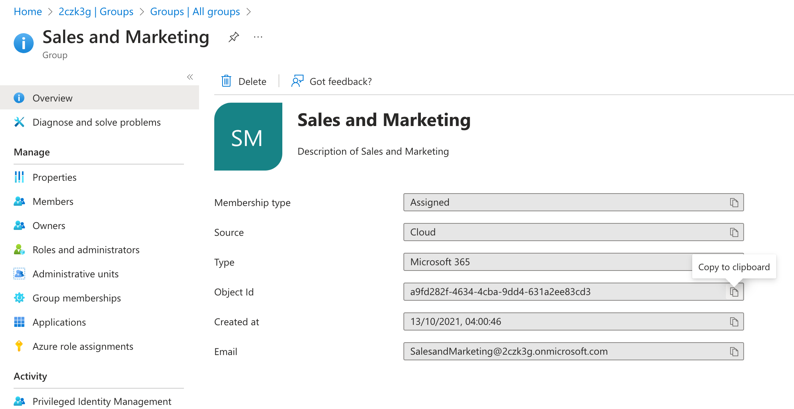

---
lab:
  title: Exercício 3 – Garantir acesso seguro com lista de controle de acesso
  module: 'LAB 02: Integrate external content with Copilot for Microsoft 365 using Microsoft Graph connectors built with .NET'
---

# Exercício 3 – Garantir acesso seguro com lista de controle de acesso

Neste exercício, você atualizará o código responsável por importar arquivos de Markdown locais com a configuração de ACLs em itens selecionados.

## Antes de começar

Este exercício levará cerca de **XX minutos** para ser concluído.

## Tarefa 1 – Importar conteúdo disponível para todo mundo na organização

Ao implementar o código para importar conteúdo externo no exercício anterior, você o configurou para estar disponível para todo mundo na organização. Este é o código que você usou:

```csharp
static IEnumerable<ExternalItem> Transform(IEnumerable<DocsArticle> content)
{
  var baseUrl = new Uri("https://learn.microsoft.com/graph/");

  return content.Select(a =>
  {
    var docId = GetDocId(a.RelativePath ?? "");

    return new ExternalItem
    {
      Id = docId,
      Properties = new()
      {
        AdditionalData = new Dictionary<string, object> {
            { "title", a.Title ?? "" },
            { "description", a.Description ?? "" },
            { "url", new Uri(baseUrl, a.RelativePath!.Replace(".md", "")).ToString() }
        }
      },
      Content = new()
      {
        Value = a.Content ?? "",
        Type = ExternalItemContentType.Html
      },
      Acl = new()
      {
          new()
          {
            Type = AclType.Everyone,
            Value = "everyone",
            AccessType = AccessType.Grant
          }
      }
    };
  });
}
```

Você configurou a ACL para conceder acesso a todo mundo. Vamos ajustá-la para páginas de Markdown selecionadas que você está importando.

## Tarefa 2 – Importar conteúdo disponível para usuários selecionados

Primeiro, configure uma das páginas que você está importando para ser acessível apenas a um usuário específico.

No navegador da Web:

1. Navegue até o portal do Azure em [https://portal.azure.com](https://portal.azure.com) e entre com sua conta corporativa ou de estudante.
1. Na barra lateral, selecione **Exibir** abaixo de **Microsoft Entra ID**.
1. Na navegação, selecione **Gerenciar** > **Usuários**.
1. Na lista de usuários, abra um dos usuários selecionando seu nome.
1. Copie o valor da propriedade **Object ID**.

  

Use esse valor para definir uma nova ACL para uma página de Markdown específica.

No editor de código:

1. Abra o arquivo **ContentService.cs** e localize o método `Transform`.
1. Dentro do delegado `Select`, defina a ACL padrão que se aplica a todos os itens importados:

   ```csharp
   var acl = new Acl
   {
     Type = AclType.Everyone,
     Value = "everyone",
     AccessType = AccessType.Grant
   };
   ```

1. Em seguida, substitua a ACL padrão para o arquivo markdown com o nome terminando em `use-the-api.md`:

   ```csharp
   if (a.RelativePath!.EndsWith("use-the-api.md"))
   {
     acl = new()
     {
       Type = AclType.User,
       // AdeleV
       Value = "6de8ec04-6376-4939-ab47-83a2c85ab5f5",
       AccessType = AccessType.Grant
     };
   }
   ```

1. Por fim, atualize o código que retorna o item externo para usar a ACL definida:

   ```csharp
   return new ExternalItem
   {
     Id = docId,
     Properties = new()
     {
       AdditionalData = new Dictionary<string, object> {
         { "title", a.Title ?? "" },
         { "description", a.Description ?? "" },
         { "url", new Uri(baseUrl, a.RelativePath!.Replace(".md", "")).   ToString() }
       }
     },
     Content = new()
     {
       Value = a.Content ?? "",
       Type = ExternalItemContentType.Html
     },
     Acl = new()
     {
       acl
     }
   };
   ```

1. O método `Transform` atualizado é assim:

   ```csharp
   static IEnumerable<ExternalItem> Transform(IEnumerable<DocsArticle>    content)
   {
     var baseUrl = new Uri("https://learn.microsoft.com/graph/");
   
     return content.Select(a =>
     {
       var acl = new Acl
       {
         Type = AclType.Everyone,
         Value = "everyone",
         AccessType = AccessType.Grant
       };
   
       if (a.RelativePath!.EndsWith("use-the-api.md"))
       {
         acl = new()
         {
           Type = AclType.User,
           // AdeleV
           Value = "6de8ec04-6376-4939-ab47-83a2c85ab5f5",
           AccessType = AccessType.Grant
         };
       }
   
       var docId = GetDocId(a.RelativePath ?? "");
   
       return new ExternalItem
       {
         Id = docId,
         Properties = new()
         {
           AdditionalData = new Dictionary<string, object> {
             { "title", a.Title ?? "" },
             { "description", a.Description ?? "" },
             { "url", new Uri(baseUrl, a.RelativePath!.Replace(".md", "")).   ToString() }
           }
         },
         Content = new()
         {
           Value = a.Content ?? "",
           Type = ExternalItemContentType.Html
         },
         Acl = new()
         {
           acl
         }
       };
     });
   }
   ```

1. Salve suas alterações.

## Tarefa 3 – Importar conteúdo disponível para um grupo selecionado

Agora, vamos estender o código para que outra página seja acessível apenas por um grupo selecionado de usuários.



Use esse valor para definir uma nova ACL para uma página de Markdown específica.

No editor de código:

1. Abra o arquivo **ContentService.cs** e localize o método `Transform`
1. Estenda a cláusula `if` definida anteriormente, com uma condição extra para definir a ACL para o arquivo markdown com nome terminando em `traverse-the-graph.md`:

   ```csharp
   if (a.RelativePath!.EndsWith("use-the-api.md"))
   {
     acl = new()
     {
       Type = AclType.User,
       // AdeleV
       Value = "6de8ec04-6376-4939-ab47-83a2c85ab5f5",
       AccessType = AccessType.Grant
     };
   }
   else if (a.RelativePath.EndsWith("traverse-the-graph.md"))
   {
     acl = new()
     {
       Type = AclType.Group,
       // Sales and marketing
       Value = "a9fd282f-4634-4cba-9dd4-631a2ee83cd3",
       AccessType = AccessType.Grant
     };
   }
   ```

1. O método `Transform` atualizado é assim:

   ```csharp
   static IEnumerable<ExternalItem> Transform(IEnumerable<DocsArticle>    content)
   {
     var baseUrl = new Uri("https://learn.microsoft.com/graph/");
   
     return content.Select(a =>
     {
       var acl = new Acl
       {
         Type = AclType.Everyone,
         Value = "everyone",
         AccessType = AccessType.Grant
       };
   
       if (a.RelativePath!.EndsWith("use-the-api.md"))
       {
         acl = new()
         {
           Type = AclType.User,
           // AdeleV
           Value = "6de8ec04-6376-4939-ab47-83a2c85ab5f5",
           AccessType = AccessType.Grant
         };
       }
       else if (a.RelativePath.EndsWith("traverse-the-graph.md"))
       {
         acl = new()
         {
           Type = AclType.Group,
           // Sales and marketing
           Value = "a9fd282f-4634-4cba-9dd4-631a2ee83cd3",
           AccessType = AccessType.Grant
         };
       }
   
       var docId = GetDocId(a.RelativePath ?? "");
   
       return new ExternalItem
       {
         Id = docId,
         Properties = new()
         {
           AdditionalData = new Dictionary<string, object> {
               { "title", a.Title ?? "" },
               { "description", a.Description ?? "" },
               { "url", new Uri(baseUrl, a.RelativePath!.Replace(".md",    "")).ToString() }
           }
         },
         Content = new()
         {
           Value = a.Content ?? "",
           Type = ExternalItemContentType.Html
         },
         Acl = new()
         {
             acl
         }
       };
     });
   }
   ```

1. Salve suas alterações.

## Tarefa 4 – Aplicar as novas ACLs

A última etapa é aplicar as ACLs recém-configuradas.

1. Abra um terminal e altere o diretório de trabalho para o projeto.
1. Compile o projeto executando o comando `dotnet build`.
1. Comece a carregar o conteúdo executando o comando `dotnet run -- load-content`.

[Continue no próximo exercício...](./5-exercise-enable-inline-results.md)