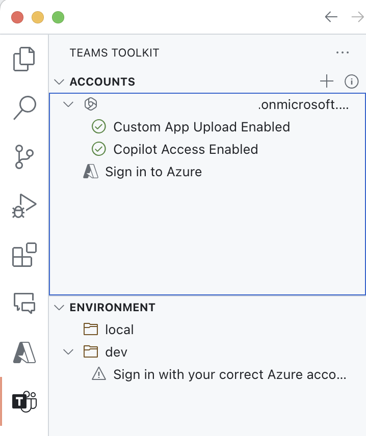
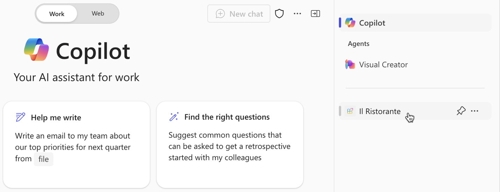
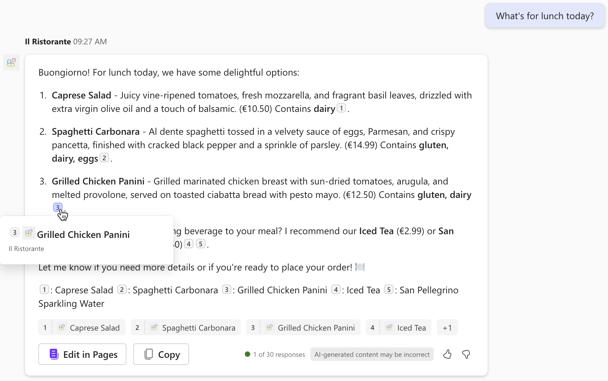
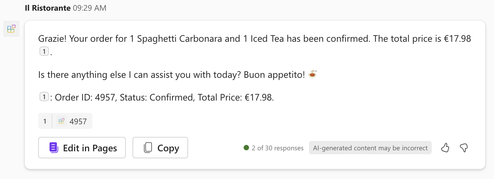
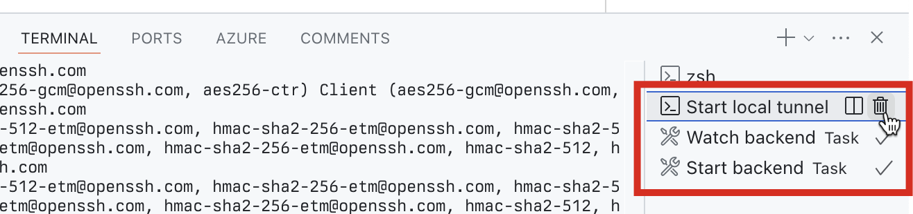

---
lab:
  title: Exercício 4 — Testar o agente declarativo com o plug-in de API no Microsoft 365 Copilot
  module: 'LAB 02: Build your first action for declarative agents with API plugin by using Visual Studio Code'
---

# Exercício 4 — Testar o agente declarativo com o plug-in de API no Microsoft 365 Copilot

Estender um agente declarativo com ações permite que ele recupere e atualize dados armazenados em sistemas externos em tempo real. Usando plug-ins de API, você pode se conectar a sistemas externos por meio de suas APIs para recuperar e atualizar informações.

### Duração do exercício

- **Tempo estimado para conclusão:** 10 minutos

## Tarefa 1 – Testar o agente declarativo

A etapa final é testar o agente declarativo com o plug-in de API no Microsoft 365 Copilot.

No Visual Studio Code:

1. Na **Barra de Atividades**, escolha **Kit de Ferramentas do Teams**.
1. Na seção **Contas**, verifique se você se conectou ao locatário do Microsoft 365 com o Microsoft 365 Copilot.

  

1. Na **Barra de Atividades**, escolha **Executar e Depurar**.
1. Selecione a configuração **Depurar no Copilot** e inicie a depuração usando o botão **Iniciar Depuração**.  

  

1. O Visual Studio Code compila e implanta seu projeto em seu locatário do Microsoft 365 e abre uma nova janela do navegador da Web.

No navegador da Web:

1. Quando solicitado, entre com a conta que pertence ao locatário do Microsoft 365 com o Microsoft 365 Copilot.
1. Na barra lateral, selecione **Il Ristorante**.

  

1. Escolha o início de conversa **O que vamos almoçar hoje?** e envie a solicitação.

  

1. Quando solicitado, examine os dados que o agente envia para a API e confirme usando o botão **Permitir uma vez**.

  

1. Aguarde a resposta do agente. Observe que, embora mostre citações das informações recuperadas da API, o pop-up mostra apenas o título do prato. Ele não mostra nenhuma informação adicional, pois o plug-in de API não define um modelo de Cartão Adaptável.

  

1. Faça um pedido digitando na caixa de texto do prompt: **1x espaguete, 1x chá gelado** e envie o prompt.
1. Examine os dados que o agente envia para a API e continue usando o botão **Confirmar**.

  

1. Aguarde até que o agente faça o pedido e retorne o resumo do pedido. Mais uma vez, observe que o agente mostra o resumo do pedido em texto sem formatação porque ele não tem um modelo de Cartão Adaptável.

  

1. Retorne ao Visual Studio Code e interrompa a depuração.
1. Mude para a guia **Terminal** e feche todos os terminais ativos.

  
