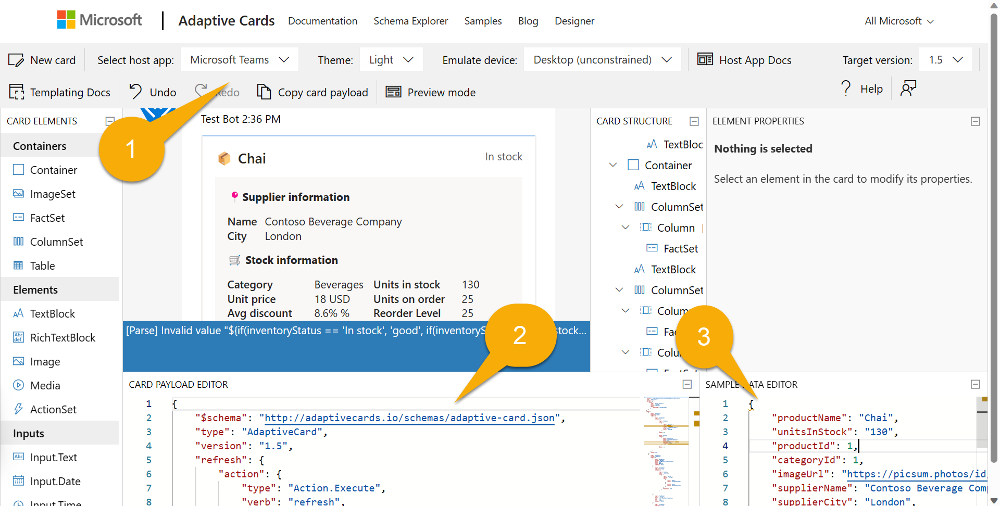

---
lab:
  title: Exercício 4 – Explorar o código-fonte do plugin
  module: 'LAB 02: Build your own message extension plugin with TypeScript (TS) for Microsoft 365 Copilot'
---

# Exercício 4 – Explorar o código-fonte do plugin

Neste exercício, você revisará o código do aplicativo para entender como funciona uma **Extensão de Mensagem**.

## Tarefa 1 – Examinar o manifesto

O núcleo de qualquer aplicativo do Microsoft 365 é seu manifesto do aplicativo. É aqui que você fornece as informações que o Microsoft 365 precisa para acessar seu aplicativo.

No **diretório de trabalho**, abra o arquivo **appPackackage/manifest.json**. Esse arquivo JSON é colocado em um arquivo zip com dois arquivos de ícone para criar o pacote do aplicativo. A propriedade **icons** inclui caminhos para esses ícones.

```json
"icons": {
    "color": "Northwind-Logo3-192-${{TEAMSFX_ENV}}.png",
    "outline": "Northwind-Logo3-32.png"
},
```

Observe o token `${{TEAMSFX_ENV}}` em um dos nomes de ícone. O Kit de Ferramentas do Teams substituirá esse token pelo nome do seu ambiente, como **local** ou **dev** (para uma implantação do Azure em desenvolvimento). Assim, a cor do ícone mudará dependendo do ambiente.

### Descrição do aplicativo

Agora dê uma olhada no **nome** e na **descrição**. Observe que a **descrição** é bem longa! Isso é importante para que os usuários e o Copilot possam aprender o que seu aplicativo faz e quando usá-lo.

```json
    "name": {
        "short": "Northwind Inventory",
        "full": "Northwind Inventory App"
    },
    "description": {
        "short": "App allows you to find and update product inventory information",
        "full": "Northwind Inventory is the ultimate tool for managing your product inventory. With its intuitive interface and powerful features, you'll be able to easily find your products by name, category, inventory status, and supplier city. You can also update inventory information with the app. \n\n **Why Choose Northwind Inventory:** \n\n Northwind Inventory is the perfect solution for businesses of all sizes that need to keep track of their inventory. Whether you're a small business owner or a large corporation, Northwind Inventory can help you stay on top of your inventory management needs. \n\n **Features and Benefits:** \n\n - Easy Product Search through Microsoft 365 Copilot. Simply start by saying, 'Find northwind dairy products that are low on stock' \r - Real-Time Inventory Updates: Keep track of inventory levels in real-time and update them as needed \r  - User-Friendly Interface: Northwind Inventory's intuitive interface makes it easy to navigate and use \n\n **Availability:** \n\n To use Northwind Inventory, you'll need an active Microsoft 365 account . Ensure that your administrator enables the app for your Microsoft 365 account."
    },
```

### Definição de bot

Role um pouco para baixo até **composeExtensions**. Extensão de redação é o termo histórico para extensão de mensagem; é aqui que as extensões de mensagem do aplicativo são definidas. As extensões de mensagem se comunicam usando o Azure Bot Framework; isso fornece um canal de comunicação rápido e seguro entre o Microsoft 365 e seu aplicativo. Quando você executou seu projeto pela primeira vez, o kit de ferramentas do Teams registrou um bot e colocará sua **botID** aqui.

```json
    "composeExtensions": [
        {
            "botId": "${{BOT_ID}}",
            "commands": [
                {
                    ...
```

### Definições de comando

Essa extensão de mensagem tem dois comandos, que são definidos na matriz `commands`. Se você concluiu o exercício anterior, haverá também um terceiro comando para pesquisar pelo nome da empresa. Vamos pular o primeiro comando por um momento, já que é o mais complexo. O comando a seguir permite que o Copilot (ou um usuário) pesquise produtos com desconto dentro de uma categoria da Northwind. Este comando aceita um único parâmetro, **categoryName**.

```json
{
    "id": "discountSearch",
    "context": [
        "compose",
        "commandBox"
    ],
    "description": "Search for discounted products by category",
    "title": "Discounts",
    "type": "query",
    "parameters": [
        {
            "name": "categoryName",
            "title": "Category name",
            "description": "Enter the category to find discounted products",
            "inputType": "text"
        }
    ]
},
```

Agora vamos voltar para o primeiro comando, **inventorySearch**, que tem cinco parâmetros, permitindo consultas muito mais sofisticadas.

```json
{
    "id": "inventorySearch",
    "context": [
        "compose",
        "commandBox"
    ],
    "description": "Search products by name, category, inventory status, supplier location, stock level",
    "title": "Product inventory",
    "type": "query",
    "parameters": [
        {
            "name": "productName",
            "title": "Product name",
            "description": "Enter a product name here",
            "inputType": "text"
        },
        {
            "name": "categoryName",
            "title": "Category name",
            "description": "Enter the category of the product",
            "inputType": "text"
        },
        {
            "name": "inventoryStatus",
            "title": "Inventory status",
            "description": "Enter what status of the product inventory. Possible values are 'in stock', 'low stock', 'on order', or 'out of stock'",
            "inputType": "text"
        },
        {
            "name": "supplierCity",
            "title": "Supplier city",
            "description": "Enter the supplier city of product",
            "inputType": "text"
        },
        {
            "name": "stockQuery",
            "title": "Stock level",
            "description": "Enter a range of integers such as 0-42 or 100- (for >100 items). Only use if you need an exact numeric range.",
            "inputType": "text"
        }
    ]
},
```

O Copilot é capaz de preenchê-los com base nas descrições e a extensão da mensagem retornará uma lista de produtos filtrados por todos os parâmetros que não estiverem em branco.

## Tarefa 2 – Examinar o código do bot

Agora, abra o arquivo **src/searchApp.ts**, que contém o código do bot que usa o [SDK do Bot Builder](https://learn.microsoft.com/azure/bot-service/index-bf-sdk) para se comunicar com o Azure Bot Framework. Observe que o bot estende uma classe do SDK **TeamsActivityHandler**.

```typescript
export class SearchApp extends TeamsActivityHandler {
  constructor() {
    super();
  }

  ...
```

### Consulta de extensão de mensagem

O aplicativo é capaz de manipular mensagens (chamadas **atividades**) provenientes do Microsoft 365 substituindo os métodos de **TeamsActivityHandler**.

A primeira delas é uma atividade de **Consulta de Extensão de Mensagem**. Essa função é chamada quando um usuário digita uma extensão de mensagem ou quando o Copilot a chama. O manipulador está despachando a consulta com base no **commandID**. Esses são os mesmos commandIDs usados no manifesto do aplicativo.

```typescript
  // Handle search message extension
  public async handleTeamsMessagingExtensionQuery(
    context: TurnContext,
    query: MessagingExtensionQuery
  ): Promise<MessagingExtensionResponse> {

    switch (query.commandId) {
      case productSearchCommand.COMMAND_ID: {
        return productSearchCommand.handleTeamsMessagingExtensionQuery(context, query);
      }
      case discountedSearchCommand.COMMAND_ID: {
        return discountedSearchCommand.handleTeamsMessagingExtensionQuery(context, query);
      }
    }
  }
  ...
```

### Ações do cartão adaptável

O outro tipo de atividades que nosso aplicativo precisa manipular são as ações do cartão adaptável, como quando um usuário seleciona **Atualizar estoque** ou **Pedir novamente** em um cartão adaptável. Como não há um método específico para uma ação de cartão adaptável, o código substitui `onInvokeActivity()`, que é uma classe de atividade muito mais ampla que inclui consultas de extensão de mensagem. Por esse motivo, o código verifica manualmente o nome da atividade e despacha para o manipulador apropriado. Se o nome da atividade não for para uma ação de cartão adaptável, a cláusula `else` executará a implementação base do `onInvokeActivity()`, que, entre outras coisas, chamará o método `handleTeamsMessagingExtensionQuery()` se a atividade **Invocar** for uma consulta.

```typescript
import {
  TeamsActivityHandler,
  TurnContext,
  MessagingExtensionQuery,
  MessagingExtensionResponse,
  InvokeResponse
} from "botbuilder";
import productSearchCommand from "./messageExtensions/productSearchCommand";
import discountedSearchCommand from "./messageExtensions/discountSearchCommand";
import revenueSearchCommand from "./messageExtensions/revenueSearchCommand";
import actionHandler from "./adaptiveCards/cardHandler";

export class SearchApp extends TeamsActivityHandler {
  constructor() {
    super();
  }

  // Handle search message extension
  public async handleTeamsMessagingExtensionQuery(
    context: TurnContext,
    query: MessagingExtensionQuery
  ): Promise<MessagingExtensionResponse> {

    switch (query.commandId) {
      case productSearchCommand.COMMAND_ID: {
        return productSearchCommand.handleTeamsMessagingExtensionQuery(context, query);
      }
      case discountedSearchCommand.COMMAND_ID: {
        return discountedSearchCommand.handleTeamsMessagingExtensionQuery(context, query);
      }
    }

  }

  // Handle adaptive card actions
  public async onInvokeActivity(context: TurnContext): Promise<InvokeResponse> {
    let runEvents = true;
    // console.log (`🎬 Invoke activity received: ${context.activity.name}`);
    try {
      if(context.activity.name==='adaptiveCard/action'){
        switch (context.activity.value.action.verb) {
          case 'ok': {
            return actionHandler.handleTeamsCardActionUpdateStock(context);
          }
          case 'restock': {
            return actionHandler.handleTeamsCardActionRestock(context);
          }
          case 'cancel': {
            return actionHandler.handleTeamsCardActionCancelRestock(context);
          }
          default:
            runEvents = false;
            return super.onInvokeActivity(context);
        }
      } else {
          runEvents = false;
          return super.onInvokeActivity(context);
      }
    } 
```

## Tarefa 3 – Examinar o código do comando de extensão de mensagem

Em um esforço para tornar o código mais modular, legível e reutilizável, cada comando de extensão de mensagem é colocado em seu próprio módulo TypeScript. Dê uma olhada em **src/messageExtensions/discountSearchCommand.ts** para ver um exemplo.

Primeiro, observe que o módulo exporta uma constante `COMMAND_ID`, que contém o mesmo **commandID** encontrado no manifesto do aplicativo e permite que a instrução switch em **searchApp.ts** funcione corretamente.

Em seguida, ele fornece uma função, `handleTeamsMessagingExtensionQuery()`, para lidar com consultas recebidas para **produtos com desconto por categoria**.

```typescript
async function handleTeamsMessagingExtensionQuery(
    context: TurnContext,
    query: MessagingExtensionQuery
): Promise<MessagingExtensionResponse> {

    // Seek the parameter by name, don't assume it's in element 0 of the array
    let categoryName = cleanupParam(query.parameters.find((element) => element.name === "categoryName")?.value);
    console.log(`💰 Discount query #${++queryCount}: Discounted products with categoryName=${categoryName}`);

    const products = await getDiscountedProductsByCategory(categoryName);

    console.log(`Found ${products.length} products in the Northwind database`)
    const attachments = [];
    products.forEach((product) => {
        const preview = CardFactory.heroCard(product.ProductName,
            `Avg discount ${product.AverageDiscount}%<br />Supplied by ${product.SupplierName} of ${product.SupplierCity}`,
            [product.ImageUrl]);

        const resultCard = cardHandler.getEditCard(product);
        const attachment = { ...resultCard, preview };
        attachments.push(attachment);
    });
    return {
        composeExtension: {
            type: "result",
            attachmentLayout: "list",
            attachments: attachments,
        },
    };
}
```

O índice na matriz `query.parameters` pode não corresponder à posição do parâmetro no manifesto. Embora isso geralmente seja apenas um problema para um comando de vários parâmetros, o código ainda obterá o valor com base no nome do parâmetro, em vez de codificar um índice.

Depois de limpar o parâmetro (cortando-o e lidando com o fato de que às vezes o Copilot assume que "**\***" é um curinga que corresponde a tudo), o código chama a camada de acesso de dados da Northwind para `getDiscountedProductsByCategory()`.

Em seguida, ele itera pelos produtos e cria dois cartões para cada um:

- um cartão de _visualização_, que é implementado como um cartão **Hero**. Ele é exibido nos resultados da pesquisa na interface do usuário e em algumas citações no Copilot.

- um cartão de _resultado_, que é implementado como um **cartão adaptável** que inclui todos os detalhes.

Na próxima tarefa, revisaremos o código do cartão adaptável e verificaremos o designer do cartão adaptável.

## Tarefa 4 – Examinar os cartões adaptáveis e o código relacionado

Os cartões adaptáveis do projeto estão na pasta **src/adaptiveCards/**. Existem três cartões, cada um implementado como um arquivo JSON.

- **editCard.json** – Este é o cartão inicial exibido pela extensão de mensagem ou uma referência do Copiloto.

- **successCard.json** – Quando um usuário executa uma ação, esse cartão é exibido para indicar sucesso. É basicamente o mesmo que o cartão de edição, exceto que inclui uma mensagem para o usuário.

- **errorCard.json** – Se uma ação falhar, este cartão será exibido.

Vamos dar uma olhada no cartão de edição no **Designer de Cartões Adaptáveis**. Abra o navegador da Web em [https://adaptivecards.io](https://adaptivecards.io) e selecione a opção **Designer** na parte superior.


Observe as expressões de vinculação de dados, como `"text": "📦 ${productName}",`. Ela vincula a propriedade `productName` nos dados ao texto no cartão.

Agora selecione **Microsoft Teams** como o aplicativo host 1️⃣. Cole todo o conteúdo de **editCard.json** no Editor ️de Carga de Cartão Adaptável 2️⃣e o conteúdo de **sampleData.json** no Editor de Dados de exemplo 3️⃣. Os dados de exemplo são idênticos a um produto, conforme fornecido no código. Você verá cartão como renderizado, exceto por um pequeno erro que surge devido à incapacidade do designer de exibir um dos formatos de cartão adaptável.



Na parte superior da página, tente alterar o **Tema** e o **Dispositivo emulado** para ver como o cartão ficaria no tema escuro ou em um dispositivo móvel. Esta é a ferramenta que foi usada para criar cartões adaptáveis para o aplicativo de exemplo.

Agora, de volta ao Visual Studio Code, abra **cardHandler.ts**. A função `getEditCard()` é chamada a partir de cada um dos comandos de extensão de mensagem para obter um cartão de **resultado**. O código lê o JSON do cartão adaptável, que é considerado um modelo, e, em seguida, o vincula aos dados do produto. O resultado é mais JSON – o mesmo cartão do modelo, com as expressões de vinculação de dados todas preenchidas. Por fim, o módulo `CardFactory` é usado para converter o JSON final em um objeto de cartão adaptável para renderização.

```typescript
function getEditCard(product: ProductEx): any {

    var template = new ACData.Template(editCard);
    var card = template.expand({
        $root: {
            productName: product.ProductName,
            unitsInStock: product.UnitsInStock,
            productId: product.ProductID,
            categoryId: product.CategoryID,
            imageUrl: product.ImageUrl,
            supplierName: product.SupplierName,
            supplierCity: product.SupplierCity,
            categoryName: product.CategoryName,
            inventoryStatus: product.InventoryStatus,
            unitPrice: product.UnitPrice,
            quantityPerUnit: product.QuantityPerUnit,
            unitsOnOrder: product.UnitsOnOrder,
            reorderLevel: product.ReorderLevel,
            unitSales: product.UnitSales,
            inventoryValue: product.InventoryValue,
            revenue: product.Revenue,
            averageDiscount: product.AverageDiscount
        }
    });
    return CardFactory.adaptiveCard(card);
}
```

Rolando para baixo, você verá o manipulador de cada um dos botões de ação no cartão. O cartão envia dados quando um botão de ação é clicado – especificamente `data.txtStock`, que é a caixa de entrada **Quantidade** no cartão, e `data.productId`, que é enviado em cada ação do cartão para que o código saiba qual produto atualizar.

```typescript
async function handleTeamsCardActionUpdateStock(context: TurnContext) {

    const request = context.activity.value;
    const data = request.action.data;
    console.log(`🎬 Handling update stock action, quantity=${data.txtStock}`);

    if (data.txtStock && data.productId) {

        const product = await getProductEx(data.productId);
        product.UnitsInStock = Number(data.txtStock);
        await updateProduct(product);

        var template = new ACData.Template(successCard);
        var card = template.expand({
            $root: {
                productName: product.ProductName,
                unitsInStock: product.UnitsInStock,
                productId: product.ProductID,
                categoryId: product.CategoryID,
                imageUrl: product.ImageUrl,
                ...
```

Como você pode ver, o código obtém esses dois valores, atualiza o banco de dados e envia um novo cartão que contém uma mensagem e os dados atualizados.

## Parabéns

Você concluiu o Exercício 5 e o laboratório do plug-in Extensões de Mensagem do Microsoft 365 Copilot. Agradeço por fazer esses laboratórios!

[Continue no resumo do laboratório...](./7-summary.md)
