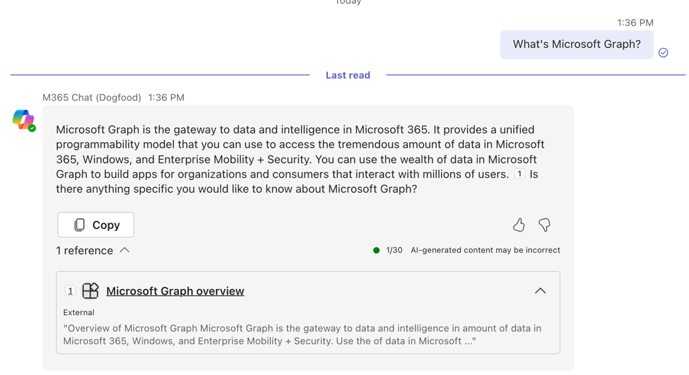
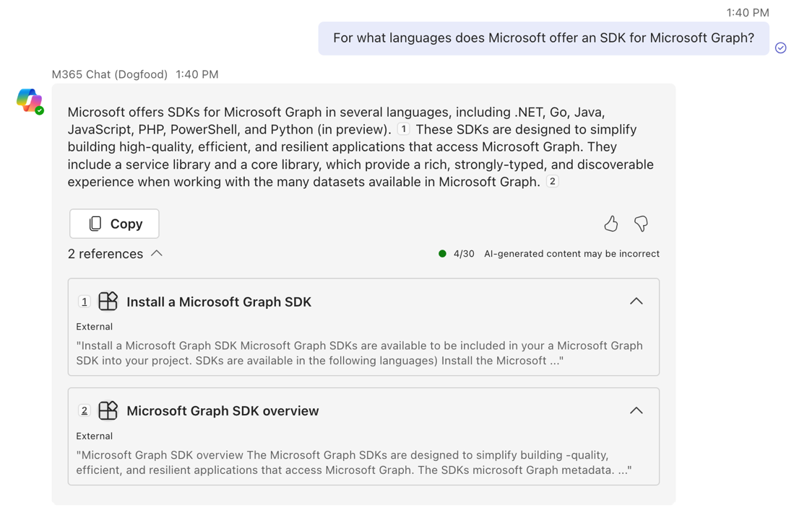

---
lab:
  title: Exercício 5 – Obter respostas com base em conteúdo externo no Copilot
  module: 'LAB 02: Integrate external content with Copilot for Microsoft 365 using Microsoft Graph connectors built with .NET'
---

# Exercício 5 – Obter respostas com base em conteúdo externo no Copilot

Neste exercício, você usará o Copilot para Microsoft 365 para obter respostas relacionadas ao uso do Microsoft Graph. O Copilot usa o conteúdo externo que você ingeriu como referência para fornecer respostas.

## Antes de começar

Este exercício levará cerca de **XX minutos** para ser concluído. Você também precisa acessar o Copilot para Microsoft 365 para concluir este exercício.

## Tarefa 1 – Obter respostas do Copilot com base em conteúdo externo

No Microsoft Teams:

1. No trilho esquerdo, selecione **Copilot**
1. Inicie a conversa perguntando: **o que é o Microsoft Graph**
1. O Copiloto responderá com uma resposta. Observe que a resposta contém uma referência ao item externo que você ingeriu anteriormente.
   
1. Continue a conversa fazendo uma pergunta de acompanhamento: **para quais idiomas a Microsoft oferece um SDK para o Microsoft Graph?**
   
1. Mais uma vez, observe que o Copilot responde usando o conteúdo que você ingeriu nos exercícios anteriores.

[Continue no resumo do laboratório...](./7-summary.md)