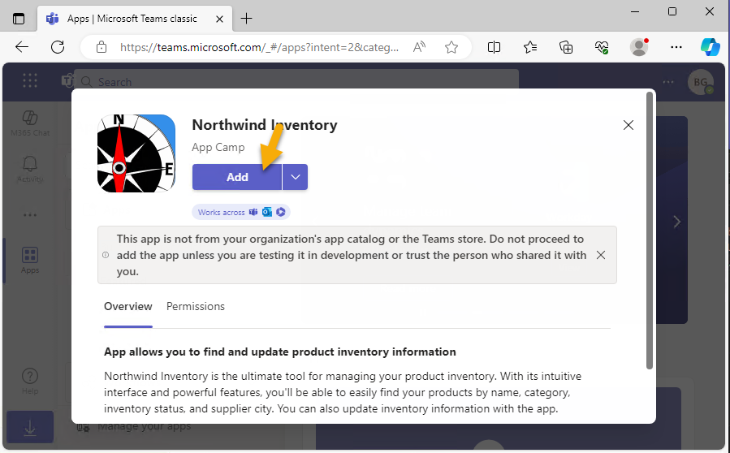
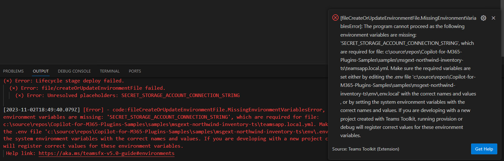

---
lab:
  title: Exercício 1 – Executar o exemplo como uma extensão de mensagem
  module: 'LAB 03: Build your own message extension plugin with TypeScript (TS) for Microsoft Copilot'
---

# Exercício 1 – Executar o exemplo como uma extensão de mensagem

Neste exercício, você executará o aplicativo como um plug-in para o Teams e o Outlook. Você testará vários prompts e observará como o plug-in é invocado usando diferentes parâmetros.

## Tarefa 1 – Configurar o projeto para primeiro uso

Neste projeto, o banco de dados Northwind é armazenado no Armazenamento de Tabelas do Azure; quando você está depurando localmente, ele usa o emulador de armazenamento [Azurite](https://learn.microsoft.com/azure/storage/common/storage-use-azurite?tabs=visual-studio). Isso está principalmente incorporado ao projeto, mas o projeto não será compilado a menos que você forneça a cadeia de conexão.

O Kit de Ferramentas do Teams armazena variáveis de ambiente na pasta **env** e preencherá todos os valores automaticamente quando você iniciar o projeto pela primeira vez. No entanto, há um valor específico para o aplicativo de exemplo, que é a cadeia de conexão para acessar o banco de dados Northwind. A configuração necessária é fornecida em um arquivo **env/.env.local.user.sample**. 

Faça uma cópia desse arquivo na pasta **env** e nomeie-o **.env.local.user**. É aqui que as configurações secretas ou confidenciais são armazenadas.

Se você não tiver certeza de como fazer isso no Visual Studio Code: 

1. Expanda a pasta **env** e clique com o botão direito do mouse em **.env.local.user.sample**. Selecione **Copiar**. 

1. Em seguida, clique com o botão direito do mouse em qualquer lugar na pasta **env** e selecione **Colar**. Você terá um novo arquivo chamado **.env.local.user copy.sample**. 

1. Use o mesmo menu de contexto para renomear o arquivo para **.env.local.user** e pronto.

    

O arquivo **.env.local.user** resultante deve conter esta linha:

```console
SECRET_STORAGE_ACCOUNT_CONNECTION_STRING=UseDevelopmentStorage=true
```

## Tarefa 2 – Executar o aplicativo localmente

1. No Visual Studio Code com a **pasta de trabalho** aberta, pressione **F5** para iniciar a depuração ou clique no botão iniciar 1️⃣. 

1. Selecione **Depurar no Teams (Edge)** 2️⃣.

    

    Na primeira vez que seu aplicativo for executado, talvez seja solicitado que você permita que o NodeJS passe pelo firewall; isso é necessário para permitir que o aplicativo se comunique.

    Pode demorar um pouco na primeira vez, pois está carregando todos os pacotes npm. Uma hora, uma janela do navegador será aberta e convidará você a entrar.

    

    Depois de entrar, o Microsoft Teams abrirá e exibirá uma caixa de diálogo oferecendo a instalação do aplicativo. Observe as informações exibidas, que são derivadas do **manifesto do aplicativo**.

1. Selecione **Adicionar** para adicionar o Inventário da Northwind como um aplicativo pessoal.

    

> [!NOTE]
> Se você vir esta tela, você precisa corrigir o arquivo **env/.env.local.user**; isso é explicado na tarefa anterior.
>
> 

Abrirá um chat dentro do aplicativo, mas você pode usar o aplicativo em qualquer chat.

## Tarefa 3 – Testar no Microsoft Teams

1. No **chat do Inventário da Northwind ** – comece a digitar uma mensagem 1️⃣ que se refere a um produto. Em seguida, para inserir um cartão adaptável para o produto, selecione **+** 2️⃣. 

1. No painel suspenso, selecione o aplicativo **Inventário da Northwind** que você acabou de instalar 3️⃣.

    

  Você verá uma caixa de diálogo de pesquisa com três guias 1️⃣. A guia **Inventário de produtos** permite pesquisar produtos por nome.

1. Digite um nome de produto ou o início de um nome de produto, como **chá**, na caixa de pesquisa 2️⃣. Se você pausar enquanto digita as primeiras letras, você verá mais opções de produtos que começam com os mesmos caracteres.

1. Selecione **Chá** 3️⃣ para inserir um cartão adaptável na conversa junto com seu comentário.

    

1. Você verá o cartão, mas não poderá usá-lo até enviá-lo. Faça as edições finais na sua mensagem e selecione **Enviar**. Observe que não há chá no pedido 1️⃣. Provavelmente temos bebedores de chá frequentes e eles podem estar vindo para cá, então é melhor pedir mais! 

    

    > [!NOTE]
    > As ações do Cartão Adaptável não funcionarão até que você envie o cartão. Se você receber um erro, verifique e certifique-se de que enviou a mensagem e está trabalhando com o cartão depois que ele foi enviado.

1. Clique no botão **executar ação** 2️⃣ para abrir um cartão filho. Insira uma quantidade 3️⃣ e clique no botão **Reabastecer** 4️⃣. O cartão será atualizado com uma mensagem de sucesso e um número atualizado de unidades no pedido.

    

Você pode cancelar o pedido ou modificar os níveis de estoque usando os outros dois botões.

## Tarefa 4 – Consultas avançadas

De volta ao Visual Studio Code, abra o arquivo de manifesto do aplicativo chamado **manifest.json** no diretório **appPackage**. Você notará que as informações do aplicativo que foram exibidas quando você instalou o aplicativo estão todas aqui. Role para baixo e encontre `composeExtensions:`. 

```json
"composeExtensions": [
    {
        "botId": "${{BOT_ID}}",
        "commands": [
            {
                "id": "inventorySearch",
                ...
                "description": "Search products by name, category, inventory status, supplier location, stock level",
                "title": "Product inventory",
                "type": "query",
                "parameters": [ ... ]
            },
            {
                "id": "discountSearch",
                ...
                "description": "Search for discounted products by category",
                "title": "Discounts",
                "type": "query",
                "parameters": [ ...]
            }
        ]
    }
],
```

> [!NOTE]
> Extensões de redação é o nome histórico de uma extensão de mensagem; a extensão de mensagem do Inventário da Northwind é definida aqui.

Primeiro, observe a **ID do bot** provisionada pelo Microsoft Teams, que usa o canal de bot do Azure para trocar mensagens seguras e em tempo real com o seu aplicativo. O Kit de Ferramentas do Teams registrará o bot e preencherá o ID para você.

Em seguida, observe a coleção de comandos. Eles correspondem às guias na caixa de diálogo de pesquisa no Teams. Neste aplicativo, os comandos destinam-se principalmente ao Copilot mais do que aos usuários comuns!

Você já executou o primeiro comando quando pesquisou um produto pelo nome. Para testar os outros comandos, digite **Bebidas**, **Laticínios** ou **Hortifruti** na guia **Descontos** e você verá os produtos com desconto nessas categorias. O Copilot pode usar sua consulta para responder perguntas sobre produtos com desconto.


Agora examine o primeiro comando novamente. Você vai notar que ele tem cinco parâmetros!

```json
"parameters": [
    {
        "name": "productName",
        "title": "Product name",
        "description": "Enter a product name here",
        "inputType": "text"
    },
    {
        "name": "categoryName",
        "title": "Category name",
        "description": "Enter the category of the product",
        "inputType": "text"
    },
    {
        "name": "inventoryStatus",
        "title": "Inventory status",
        "description": "Enter what status of the product inventory. Possible values are 'in stock', 'low stock', 'on order', or 'out of stock'",
        "inputType": "text"
    },
    {
        "name": "supplierCity",
        "title": "Supplier city",
        "description": "Enter the supplier city of product",
        "inputType": "text"
    },
    {
        "name": "stockQuery",
        "title": "Stock level",
        "description": "Enter a range of integers such as 0-42 or 100- (for >100 items). Only use if you need an exact numeric range.",
        "inputType": "text"
    }
]
```

Enquanto o Teams só pode exibir o primeiro parâmetro, o Copilot pode usar os cinco, permitindo que ele faça consultas mais avançadas dos dados do inventário da Northwind. Como solução alternativa para a limitação da interface do usuário do Teams, a guia **Inventário da Northwind** aceitará até cinco parâmetros separados por vírgula, usando o formato:

```console
name,category,inventoryStatus,supplierCity,supplierName
```


Leia as descrições no JSON acima com ateção ao inserir uma consulta. Tente inserir os termos listados abaixo e, ao fazê-lo, fique de olho na guia do console de depuração no Visual Studio Code, onde você verá cada consulta à medida que for executada.

- **_chá_** – Encontre produtos com nomes que comecem com **chá**.

- **_c,beb_** – Encontre produtos em categorias começando com **beb** e nomes que comecem com **c**.

- **_,,sem_** – encontre produtos que estão sem estoque.

- **_,,on,Londres_** – encontre produtos que estão no pedido de fornecedores em Londres.

- **_tofu,hortifruti,,Osaka_** – encontre produtos na categoria **hortifruti** com fornecedores em **Osaka** e nomes que começam com **tofu**.

Cada termo de consulta filtra a lista de produtos. O formato de cada termo de consulta é arbitrário – apenas certifique-se de explicá-los ao Copilot na descrição de cada parâmetro.

## Tarefa 5 – Testar no Microsoft Outlook

Vamos fazer um breve desvio para que você possa ver como as extensões de mensagem funcionam no Microsoft Outlook.

1. Primeiro, abra o menu aplicativo do Microsoft 365 1️⃣ e clique em **Outlook** 2️⃣.

    

1. Selecione **Novo email** para começar a redigir um email.

    

1. Adicione um **destinatário** 1️⃣ e um **assunto** 2️⃣ e, em seguida, posicione o cursor no corpo da mensagem 3️⃣. Você pode até digitar alguma coisa. Quando estiver tudo pronto, selecione o **botão do aplicativo** na barra de ferramentas 4️⃣.

    

1. Selecione o aplicativo **Inventário da Northwind**, pesquisando para encontrá-lo, se necessário.

    

1. Procure por **Chá** 1️⃣ como antes e selecione o resultado para inserir o cartão adaptáve 2️⃣.

    

    

> [!NOTE]
> O cartão adaptável não funcionará até que você envie a mensagem. O destinatário não poderá visualizar o cartão se não usar o Microsoft Outlook e não poderá executar uma ação sobre ele se não tiver o aplicativo Inventário da Northwind instalado.

## Tarefa 6 – Exibir banco de dados Northwind no Gerenciador de Armazenamento do Azure

O banco de dados Northwind não é chique, mas é real! Se você quiser espiar ou até mesmo modificar os dados:

1. Abra o [Gerenciador de Armazenamento do Azure](https://azure.microsoft.com/products/storage/storage-explorer/) enquanto o Azurite está em execução (a execução do aplicativo inicia o Azurite automaticamente).

1. Abra **Emulador e Anexado**, **Contas de Armazenamento**, **Emulador – Porta Padrão** e **Tabelas** para exibir os dados da Northwind.

    

O código lê a tabela **Produtos** em cada consulta, mas as outras tabelas só são acessadas quando o aplicativo é iniciado. Portanto, se você quiser adicionar uma nova categoria, precisará reiniciar o aplicativo para que ela apareça.

## Verifique seu trabalho

Depois de seguir todas as tarefas neste exercício, você terá um aplicativo de extensão de mensagem funcional que pode ser usado como um plug-in do Microsoft 365 para Teams ou Outlook.

Quando tudo estiver funcionando, você pode executar o aplicativo de exemplo no **Microsoft Copilot para Microsoft 365**! 

[Continue no próximo exercício...](./4-exercise-2-run-copilot-plugin.md)
