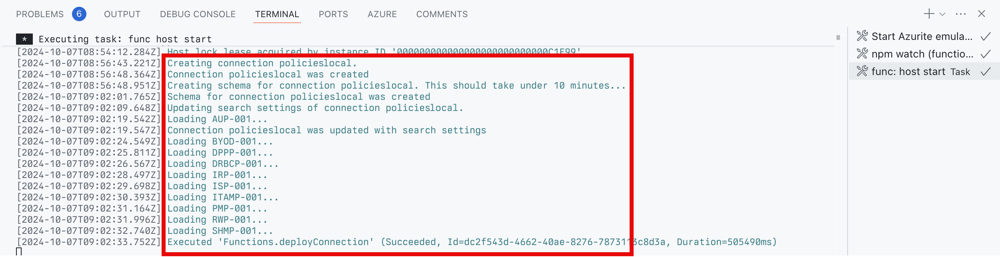

---
lab:
  title: Exercício 1 — Criar uma conexão externa para o conector do Graph
  module: 'LAB 04: Add custom knowledge to declarative agents using Microsoft Graph connectors and Visual Studio Code'
---

# Exercício 1 — Criar uma conexão externa para o conector do Graph

Estender um agente declarativo com conhecimento dá a ele acesso a informações adicionais que não fazem parte de seu grande modelo de linguagem. Usando conectores do Graph, você pode injetar dados externos no Microsoft 365, onde eles estão disponíveis para diferentes experiências do usuário, inclusive o Microsoft 365 Copilot. Ao definir as configurações de conhecimento de um agente do Copilot, você pode integrá-lo a uma conexão externa criada por um conector do Graph.

### Duração do exercício

- **Tempo estimado para conclusão:** 10 minutos

## Tarefa 1 — Baixar o projeto de exemplo e conectar-se aos recursos

Ao integrar um agente do Copilot a um conector do Graph, você precisa especificar a ID da conexão externa que o conector criou. Normalmente, você implanta conectores do Graph separadamente dos agentes do Copilot. Para concluir este exercício, implante um conector do Graph existente, que você referenciará em etapas posteriores.

Comece baixando o projeto de exemplo do conector do Graph.

1. Em um navegador da Web, acesse [https://aka.ms/learn-gc-ts-policies](https://aka.ms/learn-gc-ts-policies). Você recebe uma solicitação para baixar um arquivo ZIP com o projeto de exemplo.
1. Salve o arquivo ZIP no seu computador.
    1. Crie uma nova pasta em **Documentos**.
    1. Extraia o conteúdo do arquivo ZIP baixado para a pasta local que você acabou de criar.
    1. Abra a pasta  no Visual Studio Code.

No Visual Studio Code:

1. No menu Arquivo, escolha a opção **Abrir pasta...**
1. Abra a pasta do projeto que você acabou de extrair para a **pasta Documentos**.
1. Na **Barra de Atividades** (barra lateral), abra a extensão **Kit de Ferramentas do Teams**.
1. No painel **Contas**, confirme que você está conectado ao seu **locatário do Microsoft 365**.
1. No painel **Contas**, confirme que você está conectado à sua **assinatura do Azure**.

    

> [!NOTE]
> Se você não tiver uma licença completa do Microsoft 365 Copilot, poderá ver "Acesso ao Copilot desativado". Os exercícios ainda podem ser feitos embora você não consiga testar totalmente o agente no Microsoft 365 Copilot Chat.

## Tarefa 2 — Executar projeto e criar conexão com o Microsoft 365

1. Inicie o projeto pressionando <kbd>F5</kbd>. O Kit de Ferramentas do Teams cria um novo registro de aplicativo do Microsoft Entra em seu locatário que permite que o conector do Graph se comunique com seu locatário do Microsoft 365. O Kit de Ferramentas do Teams também inicia a Função do Azure disparada por temporizador que hospeda o conector do Graph.

> [!IMPORTANT]
> Essa etapa pode levar 10 minutos ou mais para ser concluída. Não feche até concluir o exercício.

1. Antes que o conector do Graph possa ser executado, você precisa consentir com as permissões de que o aplicativo Entra precisa. Para conceder consentimento, use as instruções do painel **Terminal** associado à tarefa **func: host start**.

    

1. Acesse a URL de consentimento em um navegador da web. Entre com sua conta de trabalho de locatário do Microsoft 365. Conceda as permissões necessárias ao aplicativo usando o botão **Conceder consentimento do administrador**.

    

1. Depois de conceder consentimento para as permissões necessárias, o conector do Graph continua. No painel **Terminal**, observe a saída do conector do Graph. O conector Graph também cria uma conexão externa, provisiona o esquema e injeta o conteúdo de exemplo em seu locatário do Microsoft 365.
1. A execução do conector leva de 5 a 10 minutos para ser concluída. Quando for concluído, pare a depuração pressionando o botão **Parar** na barra de ferramentas de depuração.

    
