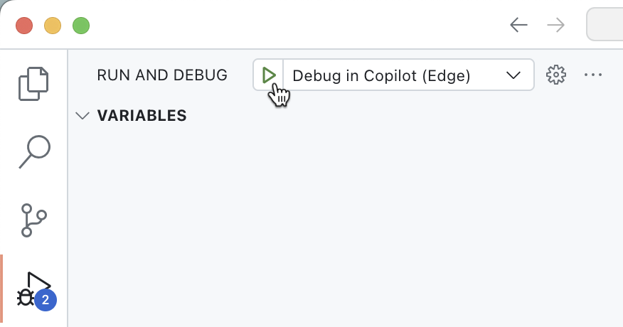
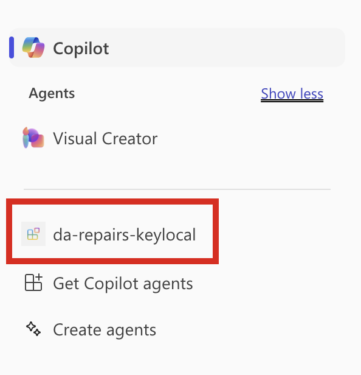
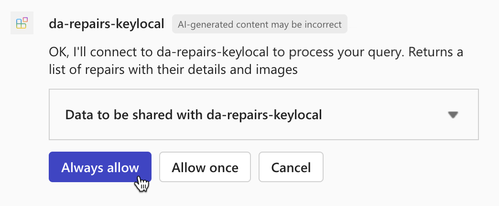

---
lab:
  title: Exercício 2 — Testar o agente declarativo no Microsoft 365 Copilot Chat
  module: 'LAB 05: Authenticate your API plugin for declarative agents with secured APIs'
---

# Exercício 2 — Testar o agente declarativo no Microsoft 365 Copilot Chat

Neste exercício, você testará e implantará seu agente declarativo no Microsoft 365 e o testará usando o Microsoft 365 Copilot Chat.

### Duração do exercício

- **Tempo estimado para conclusão:** 10 minutos

## Tarefa 1 — Testar o agente declarativo com o plug-in de API no Microsoft 365 Copilot Chat

A etapa final é testar o agente declarativo com o plug-in de API no Microsoft 365 Copilot.

No Visual Studio Code:

1. Na Barra de Atividades, abra a extensão **Kit de Ferramentas do Teams**.
1. No painel de extensão do **Kit de Ferramentas do Teams**, na seção **Contas**, verifique se você está conectado ao seu locatário do Microsoft 365.

  

1. Na Barra de Atividades, alterne para a exibição Executar e Depurar.
1. Na lista de configurações, escolha **Depurar no Copilot (Edge)** e pressione o botão Reproduzir para iniciar a depuração.

  

  O Visual Studio Code abre um novo navegador da Web com o Microsoft 365 Copilot Chat. Se for solicitado, entre com a sua conta Microsoft 365.

No navegador da Web:

1. No painel lateral, selecione o agente **da-repairs-keylocal**.

  

1. Na caixa de texto do prompt, digite `What repairs are assigned to Karin?` e envie o prompt.
1. Confirme que deseja enviar dados para o plug-in da API usando o botão **Sempre permitir** .

  

1. Aguarde a resposta do agente.

  

Pare a sessão de depuração no Visual Studio Code quando terminar de testar.