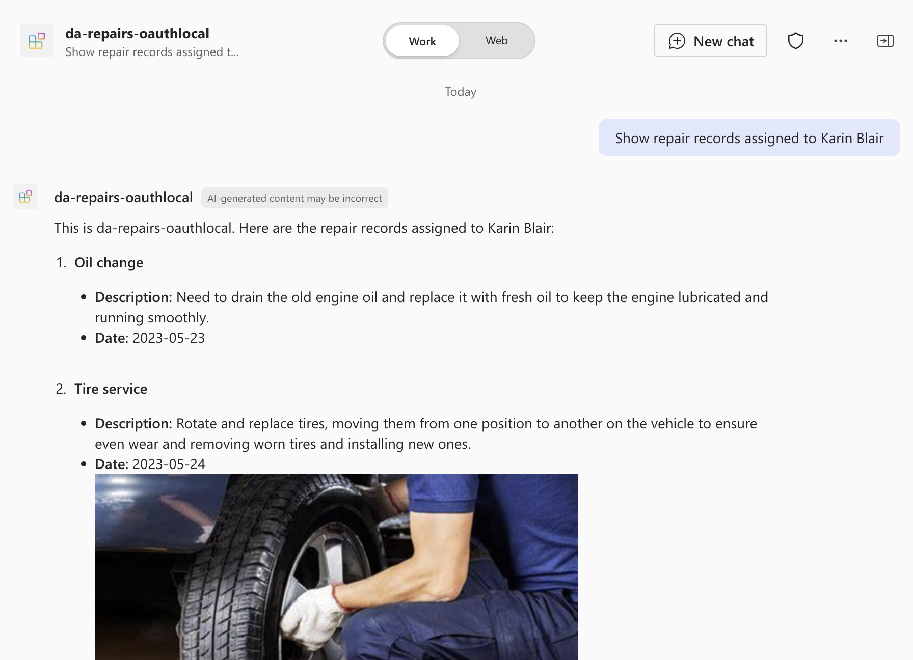

---
lab:
  title: Exercício 4 — Testar o agente declarativo no Microsoft 365 Copilot Chat
  module: 'LAB 05: Authenticate your API plugin for declarative agents with secured APIs'
---

# Exercício 34 — Testar o agente declarativo no Microsoft 365 Copilot

Neste exercício, você testará e implantará seu agente declarativo no Microsoft 365 e o testará usando o Microsoft 365 Copilot Chat.

### Duração do exercício

- **Tempo estimado para conclusão:** 5 minutos

## Tarefa 1 — Testar o agente declarativo com o plug-in de API no Microsoft 365 Copilot

A etapa final é testar o agente declarativo com o plug-in de API no Microsoft 365 Copilot.

No Visual Studio Code:

1. Na Barra de Atividades, abra a extensão **Kit de Ferramentas do Teams**.
1. No painel de extensão do **Kit de Ferramentas do Teams**, na seção **Contas**, verifique se você está conectado ao seu locatário do Microsoft 365.

    

1. Na Barra de Atividades, alterne para a exibição **Executar e Depurar**.
1. Na lista de configurações, escolha **Depurar no Copilot (Edge)** e pressione o botão Reproduzir para iniciar a depuração.

    

    O Visual Studio Code abre um novo navegador da Web com o Microsoft 365 Copilot. Se for solicitado, entre com a sua conta Microsoft 365.

No navegador da Web:

1. No painel lateral, selecione o agente **da-repairs-oauthlocal**.

    

1. Na caixa de texto do prompt, digite `Show repair records assigned to Karin Blair` e envie o prompt.

    > [!TIP]
    > Em vez de digitar o prompt, você pode selecioná-lo nos iniciadores de conversa.

    

1. Confirme que deseja enviar dados para o plug-in da API usando o botão **Sempre permitir** .

    

1. Quando for solicitado, entre na API para continuar usando a mesma conta que você usa para entrar no seu locatário do Microsoft 365, selecionando **Entrar em da-repairs-oauthlocal**.

    

1. Aguarde a resposta do agente.

    

Mesmo que sua API esteja acessível anonimamente porque está em execução em seu computador local, o Microsoft 365 Copilot está chamando sua API autenticada conforme a especificação da API. Você pode verificar se a solicitação contém um token de acesso, definindo um ponto de interrupção na função de **reparos** e enviando outro prompt no agente declarativo. Quando o código atingir seu ponto de interrupção, expanda a coleção req.headers e procure pelo cabeçalho de autorização que contém um Token Web JSON (JWT).

Pare a sessão de depuração no Visual Studio Code quando terminar de testar.
